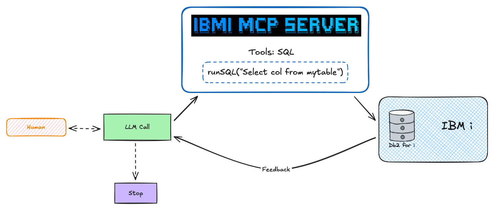

<div align="center">


[](https://www.typescriptlang.org/)
[](https://github.com/modelcontextprotocol/typescript-sdk)
[](https://github.com/modelcontextprotocol/modelcontextprotocol/blob/main/docs/specification/2025-06-18/changelog.mdx)
[](https://opensource.org/licenses/Apache-2.0)
[](https://github.com/IBM/ibmi-mcp-server.git)
[](https://deepwiki.com/IBM/ibmi-mcp-server)


**MCP server and CLI for IBM i**
</div>

---


## Overview

The **IBM i MCP Server** enables AI agents to interact with IBM i systems through the Model Context Protocol (MCP). It provides secure, SQL-based access to Db2 for i databases, allowing AI applications like Claude, VSCode Copilot, Bob, and custom agents to query system information, monitor performance, and execute database operations.

This repo also ships the **`ibmi` CLI** ([`@ibm/ibmi-cli`](https://www.npmjs.com/package/@ibm/ibmi-cli)) — a terminal-first sibling that shares the same YAML-driven SQL tool engine, so the same tool definitions work in both the MCP server and the CLI.



> **How it works:** AI clients connect via MCP → Server executes YAML-defined SQL tools → Results stream back to the AI agent through Mapepire.


> [!TIP]
> **📚 [Official Documentation](https://ibm-d95bab6e.mintlify.app/) | ⚠️ Docs are under active development**
>  
> The Docs are continuously evolving. Please check back frequently for updates and new guides. If there's something missing, feel free to open an issue!

### Repository Structure

| Directory | Purpose | Documentation |
|-----------|---------|---------------|
| **`packages/server/`** | MCP server implementation (TypeScript) — `@ibm/ibmi-mcp-server` on npm | [Server README](./packages/server/README.md) |
| **`packages/cli/`** | `ibmi` command-line interface — `@ibm/ibmi-cli` on npm, co-versioned with the server | [CLI README](./packages/cli/README.md) |
| **`tools/`** | YAML-based SQL tool configurations | [Tools Guide](./tools/README.md) |
| **`agents/`** | AI agent examples and integrations | [Agents Guide](./agents/README.md) |
| **`client/`** | Python client examples for testing | [Client README](./client/README.md) |
| **`deployment/`** | Docker, Podman, OpenShift configs | [Deployment Guide](./deployment/README.md) |
| **`app/`** | Example Full stack Agent app (AgentOS) | [App README](./app/README.md) |

### Quick Navigation

- [MCP Server](#mcp-server) - Get started with the server
- [IBM i CLI](#ibm-i-cli) - Terminal-first SQL and tool execution
- [SQL Tools](#sql-tools) - Create custom SQL tools
- [AI Agents](#ai-agents) - Use agent frameworks
- [Python Clients](#python-clients) - Test with Python clients
- [Deployment](#deployment) - Deploy to production
- [Setup Mapepire](#setup-mapepire) - Install prerequisite

---

## MCP Server

The MCP Server enables AI agents to execute SQL queries on IBM i systems through YAML-defined SQL tools.

### Quick Start

**Prerequisites:**
- [Mapepire](#setup-mapepire) running on IBM i (port 8076)
- Node.js 18+ installed

**Get Started:**

1. **Clone the repository:**
   ```bash
   git clone https://github.com/IBM/ibmi-mcp-server.git
   cd ibmi-mcp-server
   ```

2. **Configure your IBM i connection:**
   ```bash
   cat > .env << 'EOF'
   DB2i_HOST=your-ibmi-host.com
   DB2i_USER=your-username
   DB2i_PASS=your-password
   DB2i_PORT=8076
   DB2i_IGNORE_UNAUTHORIZED=true
   EOF
   ```

3. **Start the server:**
   ```bash
   npx -y @ibm/ibmi-mcp-server@latest \
      --transport http \
      --tools ./tools/performance/performance.yaml
   ```

   > The server will use our pre-configured tools for:
   > - 📊 Performance monitoring (system status, memory pools, active jobs)
   > - See the [Tools Guide](https://ibm-d95bab6e.mintlify.app/sql-tools/using-default-tools) for more toolsets.

   The MCP server can also run in a Docker container:

   ```bash
   docker run --rm --name ibmi-mcp-server \
     -v /path/to/tools/:/tools \
     -v /path/to/.env/:/.env \
     -e MCP_SERVER_CONFIG=/.env \
     -p 3010:3010 ghcr.io/ibm/ibmi-mcp-server:latest
   ```

   > Replace the volume paths with your actual local paths to the tools directory and `.env` file.

4. **Verify it's running:**
   ```bash
   # Check server health
   curl http://localhost:3010/healthz

   # List available tools
   curl -X POST http://localhost:3010/mcp \
     -H "Content-Type: application/json" \
     -H "Accept: application/json, text/event-stream" \
     -d '{"jsonrpc":"2.0","id":1,"method":"tools/list"}' | \
     grep -o '"name":"[^"]*"' | sed 's/"name":"//g' | sed 's/"//g' | head -20
   ```


> [!NOTE]
> **[📖 Full Server Quickstart →](https://ibm-d95bab6e.mintlify.app/quickstart)**
>
> **Next Steps:**
> - [Create Custom Tools](https://ibm-d95bab6e.mintlify.app/sql-tools/overview) - Build your own SQL tools
> - [Connect AI Clients](https://ibm-d95bab6e.mintlify.app/clients/overview) - Integrate with Claude, VSCode, Bob, etc.
>
> **Additional links:**
> - [Server README](./packages/server/README.md)
> - [Server Configuration](./packages/server/README.md#️-configuration)
> - Looking for the terminal CLI instead? Jump to [IBM i CLI](#ibm-i-cli).

---

## IBM i CLI

A terminal-first sibling to the MCP server. The `ibmi` command shares the same YAML-driven SQL tool engine and is designed for local exploration, ad-hoc queries, scripted automation, and CI/CD — no MCP client required.

### Quick Start

```bash
# Install
npm i -g @ibm/ibmi-cli

# Run a query
ibmi sql "SELECT * FROM SAMPLE.EMPLOYEE FETCH FIRST 5 ROWS ONLY"

# Run a YAML-defined tool
ibmi tool system_status --tools ./tools/work-management.yaml
```

### When to use the CLI vs. the MCP Server

Both tools sit on top of the same YAML tool engine. The **MCP Server** is the de facto interface for building AI agents and multi-client AI workloads. The **CLI** covers everything else — and also serves as a lightweight, process-local alternative when a full MCP server is overkill.

| Use the CLI when… | Use the MCP Server when… |
|-------------------|--------------------------|
| You need **developer ergonomics** — an interactive terminal experience for querying Db2 for i, exploring schemas, scripting in shell/CI, or piping results into other tools | You are **building AI agents or AI-powered applications** that should call IBM i tools conversationally (Claude Desktop, VSCode Copilot, Bob, Agno, LangChain, custom agents) |
| You are running a **local AI agent** and want the CLI as a lightweight, in-process alternative to a long-lived MCP server — e.g., a coding agent that shells out to `ibmi sql` or `ibmi tool` as part of its loop | You need remote server support over the MCP protocol, including `stdio` or HTTP transports |
| You want **fast synchronous execution** against one or many systems with rich output formats (`table`, `json`, `csv`, `markdown`, NDJSON) and no server process to manage | You need **shared, networked access** with auth, rate limiting, structured telemetry, and session handling |

> See the [CLI Agent Integration guide](https://ibm-d95bab6e.mintlify.app/cli/agent-integration) for concrete examples of wiring the `ibmi` CLI into local AI agents.

> [!NOTE]
> **[📖 Full Documentation: CLI Guide →](https://ibm-d95bab6e.mintlify.app/cli/overview)**
>
> **Additional links:**
> - [CLI README](./packages/cli/README.md)
> - [Getting Started](https://ibm-d95bab6e.mintlify.app/cli/getting-started)
> - [Commands Reference](https://ibm-d95bab6e.mintlify.app/cli/commands)
> - [Output Formats](https://ibm-d95bab6e.mintlify.app/cli/output-formats)
> - [Agent Integration](https://ibm-d95bab6e.mintlify.app/cli/agent-integration)

---

## SQL Tools

YAML-based SQL tool configurations that define what queries AI agents can execute on your IBM i system.

### Quick Start

Create a custom tool file `tools/my-tools.yaml`:

```yaml
sources:
  my-system:
    host: ${DB2i_HOST}
    user: ${DB2i_USER}
    password: ${DB2i_PASS}
    port: 8076
    ignore-unauthorized: true

tools:
  system_status:
    source: ibmi-system
    description: "Overall system performance statistics with CPU, memory, and I/O metrics"
    parameters: []
    statement: |
      SELECT * FROM TABLE(QSYS2.SYSTEM_STATUS(RESET_STATISTICS=>'YES',DETAILED_INFO=>'ALL')) X

toolsets:
  performance:
    tools:
      - system_status
```

Run the server with your tools:
```bash
npx -y @ibm/ibmi-mcp-server@latest --tools ./tools/my-tools.yaml --transport http
```

### Available Tool Collections

The `tools/` directory includes ready-to-use configurations:

- **Performance Monitoring** - System status, active jobs, CPU/memory metrics
- **Security & Audit** - User profiles, authorities, security events
- **Job Management** - Active jobs, job queues, subsystems
- **Storage & IFS** - Disk usage, IFS objects, save files
- **Database** - Tables, indexes, constraints, statistics

> [!NOTE]
> **[📖 Full Documentation: Tools Guide →](https://ibm-d95bab6e.mintlify.app/sql-tools/overview)**
>
> **Additional links:**
> - [Tools README](./tools/README.md)

---

## AI Agents

Pre-built AI agent examples using popular frameworks to interact with IBM i systems through the MCP Server.

### Available Agent Frameworks

| Framework | Language | Use Case | Documentation |
|-----------|----------|----------|---------------|
| **Agno** | Python | Production-ready agents with built-in observability | [Agno README](./agents/frameworks/agno/README.md) |
| **LangChain** | Python | Complex workflows and tool chaining | [LangChain README](./agents/frameworks/langchain/README.md) |
| **Google ADK** | Python | Google AI ecosystem integration | [Google ADK README](./agents/frameworks/google_adk/README.md) |

### What Agents Can Do

- **System Monitoring**: Real-time performance analysis and health checks
- **Troubleshooting**: Diagnose issues using natural language queries
- **Reporting**: Generate system reports and insights
- **Automation**: Execute administrative tasks through conversation

> [!NOTE]
> **[📖 Full Documentation: Agents Guide →](https://ibm-d95bab6e.mintlify.app/agents/overview)**
> 
> **Additional links:**
> - [Agents README](./agents/README.md)

---

## Python Clients

Simple Python client examples for testing and interacting with the MCP Server.

```python
import asyncio
from mcp import ClientSession
from mcp.client.streamable_http import streamablehttp_client

async def main():
    # Connect to the IBM i MCP server with authentication
    async with streamablehttp_client("http://localhost:3010/mcp") as (
        read_stream,
        write_stream,
        _,
    ):
        # Create a session using the authenticated streams
        async with ClientSession(read_stream, write_stream) as session:
            # Initialize the connection
            await session.initialize()

            # List available tools (now authenticated with your IBM i credentials)
            tools = await session.list_tools()
            for i, tool in enumerate(tools.tools, 1):
                print(f"{i:2d}. {tool.name}")
                print(f"    └─ {tool.description}")

            # Execute a tool with authenticated IBM i access
            print("\n" + "=" * 80)
            print("SYSTEM ACTIVITY RESULT")
            print("=" * 80)
            result = await session.call_tool("system_activity", {})

            print(result)


if __name__ == "__main__":
    asyncio.run(main())
```

> [!NOTE]
> **[📖 Full Documentation: Client README →](https://ibm-d95bab6e.mintlify.app/clients/overview)**
> 
> **Additional links:**
> - [Client README](./client/README.md)

---

## Deployment

Production-ready deployment configurations for containerized environments.

### Deployment Options

- **Docker & Podman** - Complete stack with MCP Context Forge Gateway
- **OpenShift** - Kubernetes deployment with S2I builds
- **Production Features** - HTTPS, authentication, monitoring, caching

> [!NOTE]
> **[📖 Full Documentation: Deployment Guide →](./deployment/README.md)**

---

## Setup Mapepire

**Before you can use the ibmi-mcp-server, you must install and configure Mapepire on your IBM i system.**

### What is Mapepire?

[Mapepire](https://mapepire-ibmi.github.io/) is a modern, high-performance database server for IBM i that provides SQL query execution capabilities over WebSocket connections. It acts as a gateway between modern application architectures (like MCP servers, AI agents, and REST APIs) and IBM i's Db2 for i database.

### Why Mapepire Enables AI and MCP Workloads

Traditional IBM i database access methods (ODBC, JDBC) don't align well with modern AI and MCP architectures that require:

- **Fast, lightweight connections**: AI agents make frequent, short-lived database queries
- **WebSocket support**: Enables real-time, bidirectional communication for streaming results
- **Modern JSON-based protocols**: Simplifies integration with TypeScript/JavaScript ecosystems
- **Low-latency responses**: Essential for interactive AI conversations and tool executions

Mapepire bridges this gap by providing a modern, WebSocket-based SQL query interface that's optimized for the request/response patterns of AI agents and MCP tools.

### Installation

**Quick Install (IBM i SSH Session):**

```bash
# 1. Install Mapepire using yum
yum install mapepire-server

# 2. Install Service Commander (if not already installed)
yum install service-commander

# 3. Start Mapepire service
sc start mapepire
```

> [!NOTE]
> **[📚 Full Documentation: Mapepire System Administrator Guide →](https://mapepire-ibmi.github.io/guides/sysadmin/)**

> [!IMPORTANT]
> **Important Notes:**
> - By default, Mapepire runs on port `8076`. You'll need this port number when configuring the `DB2i_PORT` variable in your `.env` file.
> - Ensure your IBM i firewall allows inbound connections on port 8076
> - For production deployments, configure SSL/TLS certificates (see official guide)

---


---

## License

This project is licensed under the Apache License 2.0. See the [LICENSE](LICENSE) file for details.
