```mermaid
graph TB
    subgraph agents["AI Agent Layer"]
        direction TB
        agent["🤖 AI Agent<br/><small>Agno/LangChain/LangGraph</small>"]
        nl["💬 Natural language interface"]
        memory["🧠 Persistent memory & context"]
    end

    subgraph filtering["FilteredMCPTools Layer"]
        direction TB
        filter["🔍 FilteredMCPTools"]
        annotations["📝 Annotation-based filtering"]
        toolsets["📦 Toolset selection<br/><small>performance, discovery, browse, search</small>"]
    end

    subgraph mcp["IBM i MCP Server"]
        direction TB
        register["📋 Register SQL tools from YAML"]
        validate["✓ Validate parameters & security"]
        format["📊 Format responses for AI"]
    end

    subgraph ibmi["IBM i System"]
        direction TB
        db2["✓ Db2 for i"]
        qsys2["✓ QSYS2 Services"]
        security["✓ Security Model"]
        sprocs["✓ Stored Procedures"]
    end

    agents -->|Uses| filtering
    filtering -->|HTTP/MCP Protocol| mcp
    mcp -->|SQL Queries| ibmi

    style agents fill:#e3f2fd,stroke:#1976d2,stroke-width:3px,color:#000
    style filtering fill:#fff3e0,stroke:#f57c00,stroke-width:3px,color:#000
    style mcp fill:#f3e5f5,stroke:#7b1fa2,stroke-width:3px,color:#000
    style ibmi fill:#e8f5e9,stroke:#388e3c,stroke-width:3px,color:#000

    style agent fill:#bbdefb,stroke:#1976d2,stroke-width:2px,color:#000
    style nl fill:#bbdefb,stroke:#1976d2,stroke-width:2px,color:#000
    style memory fill:#bbdefb,stroke:#1976d2,stroke-width:2px,color:#000

    style filter fill:#ffe0b2,stroke:#f57c00,stroke-width:2px,color:#000
    style annotations fill:#ffe0b2,stroke:#f57c00,stroke-width:2px,color:#000
    style toolsets fill:#ffe0b2,stroke:#f57c00,stroke-width:2px,color:#000

    style register fill:#e1bee7,stroke:#7b1fa2,stroke-width:2px,color:#000
    style validate fill:#e1bee7,stroke:#7b1fa2,stroke-width:2px,color:#000
    style format fill:#e1bee7,stroke:#7b1fa2,stroke-width:2px,color:#000

    style db2 fill:#c8e6c9,stroke:#388e3c,stroke-width:2px,color:#000
    style qsys2 fill:#c8e6c9,stroke:#388e3c,stroke-width:2px,color:#000
    style security fill:#c8e6c9,stroke:#388e3c,stroke-width:2px,color:#000
    style sprocs fill:#c8e6c9,stroke:#388e3c,stroke-width:2px,color:#000
```

AI agents provide intelligent automation and assistance for IBM i system administration through natural language interfaces. The IBM i MCP server enables you to build **specialized agents** that focus on specific domains (performance monitoring, system discovery, security auditing) rather than monolithic agents attempting all tasks.

---


## Architecture Overview

The IBM i MCP server provides the foundation for building specialized agents. Agents connect to the MCP server, which exposes IBM i capabilities through SQL-based tools organized into **toolsets**. This architecture enables you to build focused agents that only see the tools they need.



### Three-Layer Design

<CardGroup cols={3}>
  <Card title="AI Agent Layer" icon="robot">
    **Your specialized agent** with natural language understanding, persistent memory, and domain-specific knowledge
  </Card>
  <Card title="Toolset Filtering" icon="filter">
    **FilteredMCPTools** provides selective tool access based on annotations (toolsets, read-only, etc.)
  </Card>
  <Card title="IBM i MCP Server" icon="server">
    **SQL tools as MCP tools** registered from YAML, validated, and formatted for AI consumption
  </Card>
</CardGroup>

---

## Building Specialized Agents with Toolsets

**Toolsets** are collections of related SQL tools that enable focused agent capabilities. Instead of giving an agent access to all 50+ tools, you configure it to use only the toolset(s) it needs.

### Example Toolsets

| Toolset | Purpose | When to Use |
|---------|---------|-------------|
| **performance** | System performance monitoring | Agents that track CPU, memory, active jobs, and resource utilization |
| **sysadmin_discovery** | High-level service discovery | Agents that explore available QSYS2 services and capabilities |
| **sysadmin_browse** | Detailed service exploration | Agents that dive deep into specific schemas and service categories |
| **sysadmin_search** | Targeted service search | Agents that find specific services by name or keyword |

<Info>
**Why Toolsets?** Specialized agents are more reliable, performant, and secure than monolithic agents. A performance monitoring agent doesn't need access to security audit tools. A discovery agent doesn't need write operations. Toolsets enforce this separation.
</Info>

### Creating Custom Toolsets

You define toolsets in your YAML tool configuration:

```yaml
# tools/custom-tools.yaml
toolsets:
  security_audit:
    tools:
      - get_failed_logins
      - list_object_authorities
      - check_password_expiry

  database_health:
    tools:
      - table_sizes
      - index_status
      - query_performance
```

Your agent framework can then filter to these custom toolsets when connecting to the MCP server.

<Card title="Build Custom Toolsets →" icon="tools" href="/sql-tools/toolsets">
  Learn how to define toolsets in YAML and use them with agents
</Card>

---

## Agent Development Approach

Building an agent for IBM i follows this high-level process:

<Steps>
  <Step title="Define Agent Purpose">
    What specific IBM i domain will this agent handle? Performance? Security? Discovery?
  </Step>

  <Step title="Select or Create Toolsets">
    Use existing toolsets or define custom ones in YAML based on your agent's needs
  </Step>

  <Step title="Configure Tool Filtering">
    Connect your agent framework to the MCP server with toolset filters
  </Step>

  <Step title="Write Agent Instructions">
    Guide the agent on how to interpret user questions and use tools effectively
  </Step>

  <Step title="Test and Deploy">
    Verify the agent's reliability and deploy as a standalone service
  </Step>
</Steps>

<Tip>
**Multi-Agent Architecture**: IBM i's traditional separation of concerns translates well to specialized agents. Rather than one agent for "IBM i administration," build separate agents for performance monitoring, security auditing, database management, etc. Each agent becomes an expert in its domain.
</Tip>

---

## Framework Options

Pre-built integrations are available for popular agent frameworks:

<CardGroup cols={3}>
  <Card title="Agno Framework" icon="https://agno-public.s3.us-east-1.amazonaws.com/assets/logo-light.svg" href="https://github.com/IBM/ibmi-mcp-server/tree/main/agents/frameworks/agno">
    Python agents with AgentOS, persistent memory, and evaluation tools
  </Card>
  <Card title="Google ADK" icon="google" href="https://github.com/IBM/ibmi-mcp-server/tree/main/agents/frameworks/google_adk">
    Google Agent Development Kit with Google AI and Vertex AI support
  </Card>
  <Card title="LangChain" icon="link" href="https://github.com/IBM/ibmi-mcp-server/tree/main/agents/frameworks/langchain">
    LangGraph-based agents with state management and workflows
  </Card>
</CardGroup>

Each integration includes example specialized agents demonstrating toolset filtering and domain-focused architectures.

---

## Next Steps

<CardGroup cols={2}>
  <Card title="SQL Tools Building" icon="database" href="/sql-tools/building-tools">
    Understand how to create SQL tools and organize them into toolsets
  </Card>
  <Card title="Toolsets Guide" icon="layer-group" href="/sql-tools/toolsets">
    Learn how to define and use toolsets for specialized agents
  </Card>
  <Card title="Agno Framework Guide" icon="rocket" href="https://github.com/IBM/ibmi-mcp-server/tree/main/agents/frameworks/agno">
    Start building agents with the recommended Agno framework
  </Card>
  <Card title="Example Agents" icon="code" href="https://github.com/IBM/ibmi-mcp-server/tree/main/agents">
    Explore pre-built specialized agents for performance, discovery, and more
  </Card>
</CardGroup>

<Note>
**Architecture Philosophy**: The IBM i MCP server encourages **specialized agents** that handle specific domains rather than monolithic agents attempting all tasks. This separation of concerns aligns with IBM i's traditional design philosophy and provides better performance, security, and maintainability.
</Note>
