AI agents provide intelligent automation and assistance for IBM i system administration through natural language interfaces. This guide covers building agents that leverage the MCP (Model Context Protocol) server's SQL tools and toolset filtering capabilities.

## Available Framework Integrations

Choose from these pre-built agent integrations to get started quickly:

<CardGroup cols={3}>
  <Card title="Agno Framework" icon="python" href="https://github.com/IBM/ibmi-mcp-server/tree/main/agents/frameworks/agno">
    Python-based agents with AgentOS, persistent memory, and evaluation framework. **Recommended for getting started.**
  </Card>
  <Card title="Google ADK" icon="google" href="https://github.com/IBM/ibmi-mcp-server/tree/main/agents/frameworks/google_adk">
    Agents built with Google's Agent Development Kit. Supports both Google AI and Vertex AI.
  </Card>
  <Card title="LangChain" icon="link" href="https://github.com/IBM/ibmi-mcp-server/tree/main/agents/frameworks/langchain">
    LangGraph-based agents with state management and workflow orchestration.
  </Card>
</CardGroup>

Each integration includes:
- **Specialized agents** for performance, discovery, browsing, and search
- **Complete setup guides** with environment configuration
- **Example queries** demonstrating agent capabilities
- **FilteredMCPTools integration** for toolset filtering

---

## What Are IBM i Agents?

IBM i agents are AI-powered assistants that:

- **Execute IBM i operations** through natural language commands
- **Access specialized toolsets** for performance monitoring, system discovery, and administration
- **Maintain context** across conversations using persistent memory
- **Respect IBM i security** by honoring user authorities and read-only constraints

<Note>
**Framework Focus**: This documentation currently focuses on **[Agno](https://docs.agno.com/introduction)**, a modern Python AI agent framework. Documentation for LangChain and LangGraph integration will be added in future releases.
</Note>

---

## Core Concepts

### Agent Architecture

IBM i agents built with this MCP server follow a specialized architecture:

<CardGroup cols={2}>
  <Card title="Toolset Filtering" icon="filter">
    Use FilteredMCPTools to limit agents to specific IBM i domains (performance, discovery, etc.)
  </Card>
  <Card title="Domain Specialization" icon="bullseye">
    Create focused agents for specific IBM i administrative tasks and workflows
  </Card>
  <Card title="MCP Integration" icon="plug">
    Connect to your IBM i MCP server with streamable HTTP transport for reliable tool access
  </Card>
  <Card title="Persistent Memory" icon="database">
    Maintain conversation context and system knowledge across sessions
  </Card>
</CardGroup>

### Why Specialized Agents?

Rather than creating one large agent with access to all tools, the IBM i MCP server encourages **specialized agents** with filtered tool access:

**Benefits:**
- **Improved accuracy** - Agents focus on specific domains they understand well
- **Better performance** - Smaller tool sets mean faster decision-making
- **Clear separation** - Different workflows use different agents
- **Enhanced security** - Limit agent capabilities to only what's needed

**Example Specializations:**
- **Performance Agent** - System monitoring, resource analysis, job tracking
- **Discovery Agent** - High-level service categorization and inventory
- **Browse Agent** - Detailed service exploration by schema or type
- **Search Agent** - Targeted lookup of specific services or examples

---

## Available Frameworks

### Agno (Current Focus)

[Agno](https://docs.agno.com/introduction) is a modern Python framework for building AI agents with:

- **FilteredMCPTools** - Annotation-based tool filtering for specialized agents
- **AgentOS** - Multi-agent deployment and management
- **Persistent memory** - SQLite-backed conversation and knowledge storage
- **Evaluation framework** - Built-in testing and reliability metrics

<Card title="Get Started with Agno" icon="rocket" href="/agents/agno/getting-started">
  Start building IBM i agents with Agno framework
</Card>

### Future Framework Support

<Note>
**Coming Soon**: Documentation for building IBM i agents using **LangChain** and **LangGraph** will be added in future releases. The FilteredMCPTools approach and toolset concepts will remain consistent across frameworks.
</Note>

---

## Quick Start Path

Ready to build your first IBM i agent? Follow this path:

<Steps>
  <Step title="Set Up MCP Server">
    Complete the [Quick Start Guide](/quickstart) to get your IBM i MCP server running with toolsets configured.
  </Step>

  <Step title="Understand FilteredMCPTools">
    Learn how [FilteredMCPTools](/agents/agno/filtered-mcp-tools) enables annotation-based tool filtering for specialized agents.
  </Step>

  <Step title="Explore Agent Patterns">
    Study the [Agent Patterns](/agents/agno/agent-patterns) to understand proven architectures for IBM i system administration.
  </Step>

  <Step title="Build Your Agent">
    Follow the [Getting Started](/agents/agno/getting-started) guide to create your first specialized agent.
  </Step>
</Steps>

---

## Architecture Overview

### Component Interaction

```mermaid
graph TB
    subgraph agents["AI Agent Layer"]
        direction TB
        agent["🤖 AI Agent<br/><small>Agno/LangChain/LangGraph</small>"]
        nl["💬 Natural language interface"]
        memory["🧠 Persistent memory & context"]
    end

    subgraph filtering["FilteredMCPTools Layer"]
        direction TB
        filter["🔍 FilteredMCPTools"]
        annotations["📝 Annotation-based filtering"]
        toolsets["📦 Toolset selection<br/><small>performance, discovery, browse, search</small>"]
    end

    subgraph mcp["IBM i MCP Server"]
        direction TB
        register["📋 Register SQL tools from YAML"]
        validate["✓ Validate parameters & security"]
        format["📊 Format responses for AI"]
    end

    subgraph ibmi["IBM i System"]
        direction TB
        db2["✓ Db2 for i"]
        qsys2["✓ QSYS2 Services"]
        security["✓ Security Model"]
        sprocs["✓ Stored Procedures"]
    end

    agents -->|Uses| filtering
    filtering -->|HTTP/MCP Protocol| mcp
    mcp -->|SQL Queries| ibmi

    style agents fill:#e3f2fd,stroke:#1976d2,stroke-width:3px,color:#000
    style filtering fill:#fff3e0,stroke:#f57c00,stroke-width:3px,color:#000
    style mcp fill:#f3e5f5,stroke:#7b1fa2,stroke-width:3px,color:#000
    style ibmi fill:#e8f5e9,stroke:#388e3c,stroke-width:3px,color:#000

    style agent fill:#bbdefb,stroke:#1976d2,stroke-width:2px,color:#000
    style nl fill:#bbdefb,stroke:#1976d2,stroke-width:2px,color:#000
    style memory fill:#bbdefb,stroke:#1976d2,stroke-width:2px,color:#000

    style filter fill:#ffe0b2,stroke:#f57c00,stroke-width:2px,color:#000
    style annotations fill:#ffe0b2,stroke:#f57c00,stroke-width:2px,color:#000
    style toolsets fill:#ffe0b2,stroke:#f57c00,stroke-width:2px,color:#000

    style register fill:#e1bee7,stroke:#7b1fa2,stroke-width:2px,color:#000
    style validate fill:#e1bee7,stroke:#7b1fa2,stroke-width:2px,color:#000
    style format fill:#e1bee7,stroke:#7b1fa2,stroke-width:2px,color:#000

    style db2 fill:#c8e6c9,stroke:#388e3c,stroke-width:2px,color:#000
    style qsys2 fill:#c8e6c9,stroke:#388e3c,stroke-width:2px,color:#000
    style security fill:#c8e6c9,stroke:#388e3c,stroke-width:2px,color:#000
    style sprocs fill:#c8e6c9,stroke:#388e3c,stroke-width:2px,color:#000
```



### Key Innovation: FilteredMCPTools

The **FilteredMCPTools** class is the foundation of specialized agent architecture. It extends standard MCP tool integration with annotation-based filtering:

```python
# Standard MCP tools - agent sees ALL tools
from agno.tools import MCPTools
all_tools = MCPTools(url="http://localhost:3010/mcp")

# Filtered MCP tools - agent sees only performance toolset
from ibmi_agents.tools.filtered_mcp_tools import FilteredMCPTools
performance_tools = FilteredMCPTools(
    url="http://localhost:3010/mcp",
    annotation_filters={"toolsets": ["performance"]}
)
```

<Card title="Learn About FilteredMCPTools" icon="filter" href="/agents/agno/filtered-mcp-tools">
  Deep dive into annotation-based tool filtering and advanced filtering patterns
</Card>

---

## Available Toolsets

Based on the prebuilt configurations, these toolsets are available for agent filtering:

| Toolset | Purpose | Example Tools |
|---------|---------|---------------|
| `performance` | System performance monitoring | system_status, memory_pools, active_jobs |
| `sysadmin_discovery` | High-level service discovery | list_service_categories, services_by_schema |
| `sysadmin_browse` | Detailed service exploration | list_services_by_category, browse_schema |
| `sysadmin_search` | Targeted service search | search_services_by_name, find_examples |

<Card title="Build Custom Toolsets" icon="tools" href="/sql-tools/toolsets">
  Learn how to create your own toolsets for specialized agent domains
</Card>

---

## Development Workflow

### Typical Agent Development Process

1. **Define agent purpose** - What specific IBM i tasks will this agent handle?
2. **Select toolsets** - Which toolsets provide the necessary capabilities?
3. **Configure FilteredMCPTools** - Set up annotation filters for tool selection
4. **Write agent instructions** - Guide the agent on how to use tools effectively
5. **Add persistent memory** - Enable context retention across conversations
6. **Test and evaluate** - Use Agno's evaluation framework to verify reliability
7. **Deploy** - Run as standalone service or integrate into AgentOS

---

## Security Considerations

IBM i agents should respect the platform's robust security model:

<AccordionGroup>
  <Accordion title="Authority-Based Access" icon="shield">
    - MCP server connects with specific IBM i user credentials
    - All SQL queries respect IBM i object-level authorities
    - Agents inherit authority constraints of the MCP server user
    - Use read-only tools for security-conscious deployments
  </Accordion>

  <Accordion title="Tool Filtering" icon="filter">
    - Use `readOnlyHint: True` annotation for read-only operations
    - Filter out `destructiveHint: True` tools for safe agents
    - Limit toolsets to minimum required for agent's purpose
    - Combine multiple annotation filters for defense in depth
  </Accordion>

  <Accordion title="Connection Security" icon="lock">
    - Use HTTPS for production MCP connections
    - Configure proper SSL/TLS certificates
    - Implement authentication at the MCP server level
    - Monitor agent activity through persistent logs
  </Accordion>
</AccordionGroup>

<Card title="Security Best Practices" icon="shield-check" href="/agents/security">
  Detailed guide on securing IBM i agents in production
</Card>

---

## Next Steps

<CardGroup cols={2}>
  <Card title="Get Started with Agno" icon="rocket" href="/agents/agno/getting-started">
    Set up your development environment and run example agents
  </Card>
  <Card title="FilteredMCPTools Guide" icon="filter" href="/agents/agno/filtered-mcp-tools">
    Master annotation-based tool filtering for specialized agents
  </Card>
  <Card title="Agent Patterns" icon="diagram-project" href="/agents/agno/agent-patterns">
    Learn proven patterns for IBM i agent architecture
  </Card>
  <Card title="SQL Tools Building" icon="database" href="/sql-tools/building-tools">
    Understand the SQL tools that power agent capabilities
  </Card>
</CardGroup>

<Note>
**Architecture Philosophy**: The IBM i MCP server encourages a **multi-agent architecture** where specialized agents handle specific domains rather than one monolithic agent attempting all tasks. This aligns with IBM i's traditional separation of concerns and provides better performance, security, and maintainability.
</Note>
