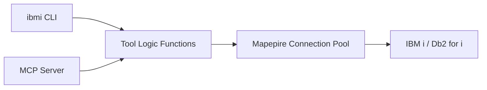

The `ibmi` CLI lets you interact with IBM i systems without starting the MCP server. Run SQL queries, explore schemas, execute YAML-defined tools, and manage multiple system connections — all from your terminal.

---

## Why Use the CLI?

<CardGroup cols={2}>
  <Card title="Direct Access" icon="terminal">
    Query IBM i databases and explore schemas without configuring an MCP client or AI agent
  </Card>
  <Card title="Multi-System" icon="server">
    Configure named connections and run queries against multiple systems in parallel with `--system dev,prod`
  </Card>
  <Card title="Agent-Friendly" icon="robot">
    Structured JSON output, NDJSON streaming, semantic exit codes, and dry-run mode for AI agent integration
  </Card>
  <Card title="YAML Tool Support" icon="file-code">
    Execute any YAML-defined SQL tool as a CLI command with automatic parameter mapping
  </Card>
</CardGroup>

---

## Quick Example

```bash
# Add a system connection
ibmi system add dev --host myhost.com --user MYUSER --password '${DB2i_PASS}'

# Run a query
ibmi sql "SELECT * FROM SAMPLE.EMPLOYEE FETCH FIRST 5 ROWS ONLY"

# Run the same query against multiple systems in parallel
ibmi sql "SELECT * FROM SAMPLE.EMPLOYEE FETCH FIRST 5 ROWS ONLY" --system dev,prod

# Explore schema metadata
ibmi schemas
ibmi tables SAMPLE
ibmi columns SAMPLE EMPLOYEE

# Generate DDL for one or more objects
ibmi describe "SAMPLE.EMPLOYEE"
ibmi describe "SAMPLE.EMPLOYEE,SAMPLE.DEPARTMENT"

# Execute a YAML tool
ibmi tool system_status --tools ./tools/performance/performance.yaml
```

<Tip>
If you already have `DB2i_HOST`, `DB2i_USER`, and `DB2i_PASS` environment variables set (from your MCP server `.env` file), the CLI picks them up automatically — no additional configuration needed.
</Tip>

---

## How It Works

The CLI reuses the same tool logic functions that power the MCP server's built-in tools. When you run `ibmi schemas`, it calls the same `listSchemasLogic` function that the MCP server uses when an AI agent invokes the `list_schemas` tool. This means you get identical query behavior and results whether you're using the CLI directly or going through an MCP client.

For YAML-defined tools, the CLI loads tool definitions and dynamically converts YAML parameters into Commander.js options — `snake_case` parameter names become `--kebab-case` flags automatically.



---

## Installation

<Tabs>
  <Tab title="NPM Package (Recommended)">
    The CLI ships with the `@ibm/ibmi-mcp-server` package:

    ```bash
    # Run directly with npx
    npx -y @ibm/ibmi-mcp-server@latest ibmi --help

    # Or install globally
    npm install -g @ibm/ibmi-mcp-server
    ibmi --help
    ```
  </Tab>

  <Tab title="Build from Source">
    ```bash
    git clone https://github.com/IBM/ibmi-mcp-server.git
    cd ibmi-mcp-server/server
    npm install
    npm run build
    npm link

    ibmi --help
    ```
  </Tab>
</Tabs>

---

## Next Steps

<CardGroup cols={2}>
  <Card title="Getting Started" icon="play" href="/cli/getting-started">
    Set up your first system connection and run your first query
  </Card>
  <Card title="Command Reference" icon="book" href="/cli/commands">
    Complete reference for all CLI commands and options
  </Card>
  <Card title="Configuration" icon="gear" href="/cli/configuration">
    Multi-system config files, environment variables, and resolution chain
  </Card>
  <Card title="Agent Integration" icon="robot" href="/cli/agent-integration">
    Use the CLI in scripts, pipelines, and AI agent workflows
  </Card>
</CardGroup>
