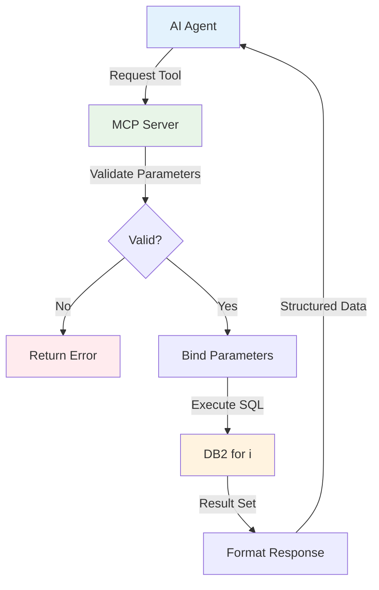

# Server Architecture

The IBM i MCP Server is a bridge that connects AI agents to your IBM i database operations. This guide explains what an MCP server is, how it works, and why using SQL as tools is powerful for IBM i environments.

<Info>
**Simple Concept**: AI agents need tools to do useful work. This MCP server turns your SQL queries into tools that AI agents can discover and use—while maintaining IBM i security and performance standards.
</Info>

---

## What is an MCP Server?

An **MCP server** is a specialized application that:

1. **Registers tools** that AI agents can discover and use
2. **Validates requests** to ensure security and correctness
3. **Executes operations** safely against your systems
4. **Returns structured results** that AI agents can understand

Think of it as a secure API layer specifically designed for AI agents, with built-in capabilities for discovery, validation, and structured responses.

<Tabs>
  <Tab title="Traditional API">
    **Traditional REST API:**
    ```
    AI Agent → Custom Integration Code → HTTP Endpoint → Database
    ```
    - Each AI tool needs custom integration
    - No standardized discovery mechanism
    - Security varies by implementation
  </Tab>

  <Tab title="MCP Server">
    **With MCP Server:**
    ```
    AI Agent → MCP Protocol → MCP Server → Database
    ```
    - Universal protocol understood by all MCP clients
    - Built-in tool discovery
    - Consistent security and validation
  </Tab>
</Tabs>

---

## SQL as MCP Tools: The Core Concept

The IBM i MCP Server's key innovation is **transforming SQL queries into MCP tools** that AI agents can use. This approach is ideal for IBM i because:

<CardGroup cols={2}>
  <Card title="Zero Code Required" icon="magic">
    Define tools in simple YAML files—no TypeScript or programming knowledge needed
  </Card>
  <Card title="IBM i Native" icon="database">
    Leverage DB2 for i, QSYS2 services, and stored procedures directly
  </Card>
  <Card title="Security Built-In" icon="shield-check">
    SQL parameter binding prevents injection attacks automatically
  </Card>
  <Card title="Rapid Development" icon="rocket">
    Create new tools in minutes, not hours or days
  </Card>
</CardGroup>

### Example: SQL Query → MCP Tool

Here's how a simple SQL query becomes an AI-usable tool:

```yaml
# YAML Configuration (tools/my-tools.yaml)
tools:
  get_active_jobs:
    source: ibmi-system
    description: "List currently active jobs with CPU usage"
    statement: |
      SELECT job_name, user_name, cpu_used, elapsed_time
      FROM qsys2.active_job_info
      WHERE job_status = 'ACTIVE'
      ORDER BY cpu_used DESC
      FETCH FIRST 20 ROWS ONLY
    parameters: []
```

**What the MCP server does:**

1. ✅ **Reads** the YAML configuration at startup
2. ✅ **Registers** `get_active_jobs` as an available tool
3. ✅ **Validates** incoming requests against the schema
4. ✅ **Executes** SQL safely with parameter binding
5. ✅ **Formats** results as structured JSON for the AI agent

**What AI agents see:**

```json
{
  "name": "get_active_jobs",
  "description": "List currently active jobs with CPU usage",
  "inputSchema": {
    "type": "object",
    "properties": {},
    "required": []
  }
}
```

The AI agent can now discover this tool, understand what it does, and call it naturally during conversations.

---

## How Requests Flow Through the Server

Understanding the request flow helps explain how SQL tools maintain security while providing flexibility:



### Step-by-Step Flow

<Steps>
  <Step title="Tool Request">
    AI agent identifies a need (e.g., "show me active jobs") and calls the `get_active_jobs` tool
  </Step>

  <Step title="Parameter Validation">
    Server validates all parameters against defined constraints (type, range, pattern, etc.)
  </Step>

  <Step title="SQL Security">
    Parameters are safely bound to SQL using prepared statements—SQL injection is impossible
  </Step>

  <Step title="Database Execution">
    SQL executes against DB2 for i using authenticated user's authorities
  </Step>

  <Step title="Result Formatting">
    Results formatted as markdown tables and structured JSON for AI consumption
  </Step>
</Steps>

<Note>
**Parameter Binding Security**: Parameter binding is the key security feature. Instead of concatenating user input into SQL strings (dangerous), parameters are bound separately by the database driver. The SQL structure cannot be modified, preventing injection attacks entirely.
</Note>

---

## Server Components

The server is organized into clear functional areas:

### 1. Tool Registry

**What it does:** Manages all available tools and their schemas

**Two types of tools:**
- **SQL Tools** (YAML-defined) - IBM i database operations
- **TypeScript Tools** (code-based) - Custom logic and external integrations

**Tool discovery:**
```bash
# AI agents can list all available tools
GET /mcp/tools/list

# Response includes tool names, descriptions, and schemas
{
  "tools": [
    {"name": "get_active_jobs", "description": "List currently active jobs..."},
    {"name": "system_status", "description": "Get system performance metrics..."}
  ]
}
```

### 2. YAML Tool Engine

**What it does:** Converts YAML configurations into executable SQL tools

**Process:**
1. **Load** YAML files from configured directories
2. **Parse** tool definitions and parameter schemas
3. **Generate** validation logic from parameter constraints
4. **Register** tools with the MCP server
5. **Execute** SQL safely when tools are called

**Configuration flexibility:**
```bash
# Load specific YAML file
npx ibmi-mcp-server --tools tools/my-tools.yaml

# Load entire directory
npx ibmi-mcp-server --tools tools/

# Load specific toolsets only
npx ibmi-mcp-server --tools tools/ --toolsets performance,security
```

### 3. Connection Management

**What it does:** Maintains secure, efficient database connections

**Features:**
- Connection pooling for performance
- Automatic reconnection on failures
- Per-user connection isolation (HTTP auth mode)
- Credential encryption (IBM i auth)

**Two authentication modes:**

<Tabs>
  <Tab title="Shared Connection (STDIO)">
    **Best for:** Development, CLI tools, single-user scenarios

    ```bash
    # All operations use same DB2i user
    DB2i_HOST=ibmi-system.com
    DB2i_USER=MCPUSER
    DB2i_PASS=password
    ```
  </Tab>

  <Tab title="Per-User Connection (HTTP)">
    **Best for:** Production, web apps, multi-user scenarios

    ```bash
    # Each user authenticates individually
    MCP_AUTH_MODE=ibmi
    IBMI_HTTP_AUTH_ENABLED=true

    # User JSMITH → Connects as JSMITH to DB2i
    # User AADAMS → Connects as AADAMS to DB2i
    ```
  </Tab>
</Tabs>

### 4. Transport Layer

**What it does:** Handles communication between AI agents and the server

**Two transport modes:**

| Transport | Use Case | Protocol | Port |
|-----------|----------|----------|------|
| **STDIO** | Development, CLI tools | stdin/stdout | N/A |
| **HTTP** | Production, web apps | HTTP/SSE | 3010 |

**STDIO** is simpler (direct process communication), while **HTTP** enables remote access, load balancing, and web integration.

---

## Repository Structure

Understanding the codebase organization helps you find what you need:

```
ibmi-mcp-server/
├── server/              # Core MCP server implementation
│   ├── src/
│   │   ├── index.ts              # Entry point
│   │   ├── mcp-server/
│   │   │   ├── server.ts         # Server initialization
│   │   │   └── tools/            # TypeScript tool implementations
│   │   └── utils/                # Shared utilities
│   └── package.json
│
├── tools/               # YAML SQL tool configurations
│   ├── sample/          # Demo tools (SAMPLE schema)
│   ├── performance/     # System monitoring
│   ├── security/        # Security analysis
│   ├── sys-admin/       # System administration
│   └── developer/       # Development tools
│
├── agents/              # Example AI agent implementations
│   └── building-agents.mdx
│
├── apps/                # Additional applications
│   └── docker-compose/  # Container deployment
│
└── docs/                # Documentation (you are here)
```

<Tip>
**Where to start:**
- Want to create SQL tools? Look in `tools/`
- Need to understand server code? Check `server/src/`
- Building agents? See `agents/`
- Deploying with Docker? Visit `apps/docker-compose/`
</Tip>

---

## Key Features

The server includes production-ready features for enterprise IBM i environments:

<AccordionGroup>
  <Accordion title="Parameter Validation" icon="shield-check">
    **Automatic validation** of all tool inputs:
    - Type checking (string, integer, float, boolean, array)
    - Range constraints (min/max values)
    - Length limits (minLength/maxLength)
    - Pattern matching (regex validation)
    - Enum restrictions (fixed value lists)

    Invalid inputs are rejected before SQL execution.
  </Accordion>

  <Accordion title="SQL Security" icon="lock">
    **Multiple security layers:**
    - Parameter binding prevents SQL injection
    - IBM i authority checking enforced
    - Audit logging for compliance
    - Row limits prevent runaway queries
    - Connection pooling isolates users

    Your IBM i security model remains intact.
  </Accordion>

  <Accordion title="Result Formatting" icon="table">
    **Flexible output formats:**
    - Markdown tables (default, LLM-friendly)
    - ASCII tables (plain text compatible)
    - Grid tables (Unicode box-drawing)
    - Compact tables (minimal spacing)
    - JSON (programmatic access)

    Configure per-tool for optimal AI consumption.
  </Accordion>

  <Accordion title="Observability" icon="chart-line">
    **Production monitoring:**
    - OpenTelemetry integration (traces, metrics)
    - Structured JSON logging
    - Request context tracking
    - Performance metrics
    - Error categorization

    Integrate with your existing monitoring systems.
  </Accordion>

  <Accordion title="Multi-Environment" icon="network-wired">
    **Flexible deployment:**
    - Development: STDIO with local config
    - Staging: HTTP with test database
    - Production: HTTP with full security
    - Docker: Container-based deployment

    Environment variables control all settings.
  </Accordion>
</AccordionGroup>

---

## Why This Architecture Works for IBM i

The SQL-as-tools approach is particularly well-suited for IBM i because:

<CardGroup cols={2}>
  <Card title="Leverages DB2 Strength" icon="database">
    IBM i's database is one of its strongest features. SQL tools expose this power directly to AI agents without additional abstraction layers.
  </Card>

  <Card title="Respects Security Model" icon="shield-alt">
    SQL executes with the authenticated user's authorities. Object-level security, special authorities, and audit trails all work as designed.
  </Card>

  <Card title="Uses QSYS2 Services" icon="cog">
    IBM i's QSYS2 schema provides rich system information. SQL tools make these services immediately available to AI agents for monitoring and analysis.
  </Card>

  <Card title="Maintains Performance" icon="gauge-high">
    Connection pooling, row limits, and optimized queries ensure AI workloads don't impact production systems. You control resource usage.
  </Card>
</CardGroup>

<Note>
**Data-in-Place Architecture**: Traditional AI integrations often require copying data out of IBM i (ETL processes, data lakes, etc.). This architecture keeps data where it belongs—in DB2 for i—while making it accessible to AI agents through controlled, secure SQL operations.
</Note>

---

## Next Steps

<CardGroup cols={2}>
  <Card title="Build SQL Tools" icon="hammer" href="/sql-tools/building-tools">
    Create your first YAML SQL tool in minutes
  </Card>
  <Card title="Complete Example" icon="book-open" href="/sql-tools/building-tools#complete-example-employee-information-tools">
    Study the comprehensive employee-info.yaml example
  </Card>
  <Card title="Client Integration" icon="plug" href="/clients/overview">
    Connect Claude, VSCode, or other MCP clients
  </Card>
  <Card title="Configuration" icon="gear" href="/configuration">
    Review all available environment variables
  </Card>
</CardGroup>

<Note>
**Architecture Philosophy**: Keep it simple. SQL queries are something IBM i professionals already understand. By turning these into MCP tools with minimal configuration, we enable rapid development of AI-accessible operations without requiring new programming paradigms or extensive training.
</Note>
