The IBM i MCP Server transforms your existing SQL interface into AI-accessible tools using a standardized protocol. Instead of building new APIs or data pipelines, this server exposes IBM i's rich database services directly to AI agents through the SQL interface you already use.


<Info>
**Core Innovation**: IBM i already has powerful SQL services (QSYS2, Db2 for i, stored procedures). The MCP server doesn't replace these—it makes them accessible to AI agents through a standardized protocol. No new infrastructure, no data duplication, just a bridge between AI and your existing IBM i capabilities.
</Info>

**Key Benefits:**
- ✅ **Zero New Infrastructure**: Uses IBM i's existing SQL interface—no middleware, no ETL
- ✅ **Standardized Protocol**: MCP is universal—works with Claude, VSCode, Cursor, and 10+ AI clients
- ✅ **IBM i Native**: Leverages QSYS2 services, Db2 optimization, and existing security model
- ✅ **Data Stays Put**: AI queries run against live data—no copies, no sync, no staleness

---

## The Architecture in One Picture

```mermaid
graph TB
    subgraph clients["AI Clients"]
        direction LR
    end

    subgraph mcp["IBM i MCP Server<br/>"]
        direction TB
        register["📋 Register SQL tools from YAML"]
        validate["✓ Validate parameters & security"]
        format["📊 Format responses for AI"]
    end

    subgraph ibmi["IBM i<br/>"]
        direction TB
        db2["✓ Db2 for i"]
        qsys2["✓ QSYS2 Services"]
        security["✓ Security Model"]
        sprocs["✓ Stored Procedures"]
    end

    clients -->|MCP Protocol<br/>| mcp
    mcp -->|SQL Queries<br/>| ibmi

    style clients fill:#e3f2fd,stroke:#1976d2,stroke-width:3px,color:#000
    style mcp fill:#fff3e0,stroke:#f57c00,stroke-width:3px,color:#000
    style ibmi fill:#e8f5e9,stroke:#388e3c,stroke-width:3px,color:#000

    style register fill:#ffe0b2,stroke:#f57c00,stroke-width:2px,color:#000
    style validate fill:#ffe0b2,stroke:#f57c00,stroke-width:2px,color:#000
    style format fill:#ffe0b2,stroke:#f57c00,stroke-width:2px,color:#000

    style db2 fill:#c8e6c9,stroke:#388e3c,stroke-width:2px,color:#000
    style qsys2 fill:#c8e6c9,stroke:#388e3c,stroke-width:2px,color:#000
    style security fill:#c8e6c9,stroke:#388e3c,stroke-width:2px,color:#000
    style sprocs fill:#c8e6c9,stroke:#388e3c,stroke-width:2px,color:#000
```



<CardGroup cols={2}>
  <Card title="What's New" icon="plus">
    **MCP Server** (middle layer) and **YAML tool definitions**

    This is the only new infrastructure you deploy
  </Card>
  <Card title="What's Reused" icon="recycle">
    **Everything else**: SQL interface, Db2, QSYS2, security, stored procedures

    All your existing IBM i capabilities
  </Card>
</CardGroup>

---

## What is an MCP Server?

An **MCP (Model Context Protocol) server** is a standardized interface that connects AI agents to external systems. Instead of building custom integrations for each AI platform, MCP provides a universal protocol that works across Claude, VSCode, Cursor, and other AI tools.

**The MCP server handles four responsibilities:**

1. **Tool Registration** - Advertises available operations to AI agents
2. **Request Validation** - Ensures parameters are correct and safe
3. **Execution** - Runs operations against your systems
4. **Response Formatting** - Returns structured results AI agents understand

Think of it as translating between "AI language" (tool calls, structured data) and "IBM i language" (SQL queries, result sets).

---

## SQL as MCP Tools: Exposing IBM i's Existing Capabilities

**The key insight**: IBM i already has everything AI agents need—DB2 for i, QSYS2 system services, performance views, security tables. The MCP server simply makes these **existing SQL interfaces** accessible to AI through standardized tool definitions.

### Why SQL is Perfect for IBM i AI Tools

IBM i's SQL interface is uniquely powerful because it provides:

<CardGroup cols={2}>
  <Card title="QSYS2 System Services" icon="server">
    **Already on your system**: 500+ views and functions for monitoring jobs, performance, security, and system health—no installation required
  </Card>
  <Card title="Db2 for i Optimization" icon="gauge-high">
    **Production-ready performance**: Query optimizer, connection pooling, result caching all work out of the box
  </Card>
  <Card title="Native Security Model" icon="shield-check">
    **Built-in authority checking**: Object-level permissions, special authorities, and audit trails just work
  </Card>
  <Card title="Stored Procedures" icon="code">
    **Existing business logic**: Call RPG, COBOL, or CL programs through SQL—no rewrites needed
  </Card>
</CardGroup>

**The MCP server's job**: Turn these SQL capabilities into discoverable tools that AI agents can use.

<Tip>
**You're not building new infrastructure**—you're exposing what's already there. A SQL query that checks system status becomes a tool AI agents can discover and call. No REST endpoints to maintain, no data to sync, no middleware to deploy.
</Tip>

### Example: Exposing QSYS2 Services to AI

Let's see how an **existing IBM i service** becomes an AI tool. No new infrastructure—just a YAML definition that exposes what's already there.

**Step 1: The SQL Service (Already Exists on IBM i)**

```sql
-- QSYS2.ACTIVE_JOB_INFO is a built-in IBM i service
-- It's already running, already optimized, already secured
SELECT job_name, cpu_time
FROM table(qsys2.active_job_info())
order by cpu_time desc
fetch first 10 rows only;
```

**Step 2: Make It an MCP Tool (YAML Definition)**

```yaml
# tools/system-monitoring.yaml
tools:
  get_active_jobs:
    source: ibmi-system
    description: "List currently active jobs with CPU usage from QSYS2.ACTIVE_JOB_INFO"
    parameters:
      - name: limit
        type: integer
        default: 10
        description: "Number of top CPU-consuming jobs to return"
    statement: |
      SELECT job_name, cpu_time
      FROM table(qsys2.active_job_info())
      order by cpu_time desc
      fetch first :limit rows only
```

**Step 3: AI Agents Discover It Automatically**

When the server starts, it registers this tool. AI agents see:

```json
{
  "name": "get_active_jobs",
  "description": "List currently active jobs with CPU usage from QSYS2.ACTIVE_JOB_INFO",
  "inputSchema": {
    "type": "object",
    "properties": {
      "limit": {
        "type": "integer",
        "description": "Number of top CPU-consuming jobs to return",
        "default": 10
      }
    },
    "required": []
  }
}
```

**Step 4: AI Agents Use It Naturally**

```
User: "Show me the top 5 CPU-consuming jobs"

AI Agent: [Calls get_active_jobs tool with limit=5]

Result:
{
  "rows": [
    {
      "job_name": "QZDASOINIT",
      "cpu_time": 45231
    },
    {
      "job_name": "QSYSARB",
      "cpu_time": 12450
    },
    {
      "job_name": "QPADEV0001",
      "cpu_time": 8932
    },
    {
      "job_name": "QTCPIP",
      "cpu_time": 5621
    },
    {
      "job_name": "QDBSRV01",
      "cpu_time": 3489
    }
  ],
  "rowCount": 5
}

AI: "The top CPU-consuming jobs are QZDASOINIT (45,231ms), QSYSARB (12,450ms), and QPADEV0001 (8,932ms)..."
```

<Note>
**What just happened**: You exposed an existing IBM i service (QSYS2.ACTIVE_JOB_INFO) to AI agents using a simple YAML file. The SQL service was already there, already secured, already optimized. The MCP server just made it discoverable and callable through a standardized protocol.
</Note>

---

## How Requests Flow Through the Server

Understanding the request flow helps explain how SQL tools maintain security while providing flexibility:


### Step-by-Step Flow

<Steps>
  <Step title="Tool Request">
    AI agent identifies a need (e.g., "show me active jobs") and calls the `get_active_jobs` tool
  </Step>

  <Step title="Parameter Validation">
    Server validates all parameters against defined constraints (type, range, pattern, etc.)
  </Step>

  <Step title="SQL Security">
    Parameters are safely bound to SQL using prepared statements—SQL injection is impossible
  </Step>

  <Step title="Database Execution">
    SQL executes against Db2 for i using authenticated user's authorities
  </Step>

  <Step title="Result Formatting">
    Results formatted as markdown tables and structured JSON for AI consumption
  </Step>
</Steps>

<Note>
**Parameter Binding Security**: Parameter binding is the key security feature. Instead of concatenating user input into SQL strings (dangerous), parameters are bound separately by the database driver. The SQL structure cannot be modified, preventing injection attacks entirely.
</Note>

---

## Server Components

The server is organized into clear functional areas:

### 1. Tool Registry

**What it does:** Manages all available tools and their schemas

**Two types of tools:**
- **SQL Tools** (YAML-defined) - IBM i database operations
- **TypeScript Tools** (code-based) - Custom logic and external integrations

**Tool discovery:**
```bash
# AI agents can list all available tools
GET /mcp/tools/list

# Response includes tool names, descriptions, and schemas
{
  "tools": [
    {"name": "get_active_jobs", "description": "List currently active jobs..."},
    {"name": "system_status", "description": "Get system performance metrics..."}
  ]
}
```

### 2. YAML Tool Engine

**What it does:** Converts YAML configurations into executable SQL tools

**Process:**
1. **Load** YAML files from configured directories
2. **Parse** tool definitions and parameter schemas
3. **Generate** validation logic from parameter constraints
4. **Register** tools with the MCP server
5. **Execute** SQL safely when tools are called

**Configuration flexibility:**
```bash
# Load specific YAML file
npx @ibm/ibmi-mcp-server@latest --tools tools/my-tools.yaml

# Load entire directory
npx @ibm/ibmi-mcp-server@latest --tools tools/

# Load specific toolsets only
npx @ibm/ibmi-mcp-server@latest --tools tools/ --toolsets performance,security
```

### 3. Connection Management

**What it does:** Maintains secure, efficient database connections

**Features:**
- Connection pooling for performance
- Automatic reconnection on failures
- Per-user connection isolation (HTTP auth mode)
- Credential encryption (IBM i auth)

**Two authentication modes:**

<Tabs>
  <Tab title="Shared Connection (STDIO)">
    **Best for:** Development, CLI tools, single-user scenarios

    ```bash
    # All operations use same DB2i user
    DB2i_HOST=ibmi-system.com
    DB2i_USER=MCPUSER
    DB2i_PASS=password
    ```
  </Tab>

  <Tab title="Per-User Connection (HTTP)">
    **Best for:** Production, web apps, multi-user scenarios

    ```bash
    # Each user authenticates individually
    MCP_AUTH_MODE=ibmi
    IBMI_HTTP_AUTH_ENABLED=true

    # User JSMITH → Connects as JSMITH to DB2i
    # User AADAMS → Connects as AADAMS to DB2i
    ```
  </Tab>
</Tabs>

### 4. Transport Layer

**What it does:** Handles communication between AI agents and the server

**Two transport modes:**

| Transport | Use Case | Protocol | Port |
|-----------|----------|----------|------|
| **STDIO** | Development, CLI tools | stdin/stdout | N/A |
| **HTTP** | Production, web apps | HTTP/SSE | 3010 |

**STDIO** is simpler (direct process communication), while **HTTP** enables remote access, load balancing, and web integration.

---

## Next Steps

<CardGroup cols={2}>
  <Card title="Build SQL Tools" icon="hammer" href="/sql-tools/building-tools">
    Create your first YAML SQL tool in minutes
  </Card>
  <Card title="Complete Example" icon="book-open" href="/sql-tools/building-tools#complete-example-employee-information-tools">
    Study the comprehensive employee-info.yaml example
  </Card>
  <Card title="Client Integration" icon="plug" href="/clients/overview">
    Connect Claude, VSCode, or other MCP clients
  </Card>
  <Card title="Configuration" icon="gear" href="/configuration">
    Review all available environment variables
  </Card>
</CardGroup>

<Note>
**Architecture Philosophy**: Leverage what exists. IBM i's SQL interface, QSYS2 services, and Db2 optimization are production-proven. Rather than building new infrastructure, this server exposes these existing capabilities to AI agents through a standardized protocol. You write YAML definitions for SQL you already know—the server handles discovery, validation, and formatting for AI consumption.
</Note>
