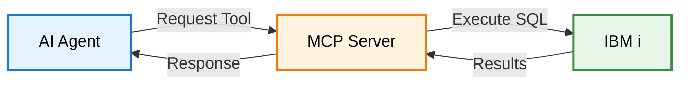

**MCP is an open standard that connects AI agents to data sources through a universal protocol.** Instead of building custom integrations for each AI tool, you implement MCP once and it works with Claude, VSCode, Cursor, and any other MCP-compatible client.

<Info>
**Think of it like HTTP for AI agents**: HTTP is the universal protocol for web browsers. MCP is becoming the universal protocol for AI agents to access external data and tools.
</Info>

<CardGroup cols={1}>
  <Card title="Official MCP Documentation" icon="book" href="https://modelcontextprotocol.io">
    Comprehensive protocol specification and guides
  </Card>
</CardGroup>

---

## MCP in Three Sentences

1. **MCP is a standardized protocol** that lets AI agents discover and use tools you provide
2. **One server, all clients** - Build once, works with any MCP-compatible AI tool
3. **Security first** - Controlled access, authentication, and audit trails built into the protocol

---

## Why MCP Matters for IBM i

**MCP lets AI agents access IBM i data while respecting your existing security model:**

- ✅ **SQL runs as the authenticated user** - IBM i object authorities apply
- ✅ **Audit trails maintained** - All operations logged with user context
- ✅ **Data stays on IBM i** - No ETL pipelines or data copies required
- ✅ **Standard tooling** - OpenTelemetry, structured logging, compliance-ready

**Real-world use cases:**
- Ask AI "What jobs are consuming CPU?" → Queries QSYS2.ACTIVE_JOB_INFO
- Ask AI "Show me sales trends" → Runs your existing SQL queries
- Ask AI "Check system health" → Executes monitoring queries you define

---

## How MCP Works



**The Flow:**

1. **AI agent requests a tool** - "I need to query active jobs"
2. **MCP server validates and executes** - Checks auth, runs SQL as authenticated user
3. **IBM i returns data** - SQL results from DB2 for i or QSYS2 services
4. **Agent receives formatted response** - Structured JSON the AI can understand

<Note>
For detailed protocol specifications, see the [official MCP documentation](https://modelcontextprotocol.io/docs/concepts/architecture).
</Note>

---

## MCP Core Concepts

MCP defines three main primitives. For IBM i, **tools** are most important:

<CardGroup cols={3}>
  <Card title="Tools" icon="wrench">
    **Operations AI agents can execute**

    For IBM i: SQL queries, stored procedure calls, system commands

    [Learn more →](https://modelcontextprotocol.io/docs/concepts/tools)
  </Card>
  <Card title="Resources" icon="file">
    **Static content AI agents can read**

    For IBM i: Documentation, schemas, configuration files

    [Learn more →](https://modelcontextprotocol.io/docs/concepts/resources)
  </Card>
  <Card title="Prompts" icon="comment">
    **Reusable prompt templates**

    For IBM i: Common query patterns, analysis templates

    [Learn more →](https://modelcontextprotocol.io/docs/concepts/prompts)
  </Card>
</CardGroup>

**Example Tool (YAML):**

```yaml
tools:
  system_status:
    description: "Get IBM i system performance metrics"
    statement: "SELECT * FROM qsys2.system_status_info"
```

This becomes a tool AI agents can discover and call automatically.

---

## IBM i MCP Server: What Makes It Different

Our implementation adds IBM i-specific features to the standard MCP protocol:

- **YAML SQL Tools** - Define database operations in simple YAML (no coding required)
- **IBM i Authentication** - Per-user authentication with RSA encryption
- **Authority Respect** - SQL runs as the authenticated user, IBM i authorities apply
- **Production Features** - OpenTelemetry, structured logging, audit trails

<Note>
For detailed architecture and implementation details, see [Server Architecture](/concepts/architecture).
</Note>

---

## MCP vs. Traditional Integration

| Approach | MCP | REST APIs | Direct DB Access |
|----------|-----|-----------|------------------|
| **Client Support** | Universal | Custom per client | Custom per client |
| **Security** | User-level auth | Varies | Service account |
| **Data Movement** | Query in place | Often requires ETL | Direct access |
| **Audit Trail** | Built-in | Custom | Database logs only |
| **Setup Complexity** | Once | Per client | Per client |

<Note>
**Key Difference:** MCP is a **standard protocol**. Build once, works with any MCP-compatible AI client—today and in the future.
</Note>

---

## Next Steps

Ready to try MCP with IBM i? Here's your path:

<CardGroup cols={2}>
  <Card title="Quick Start (15 min)" icon="rocket" href="/quickstart">
    Install the server and run your first SQL tool
  </Card>
  <Card title="Server Architecture" icon="sitemap" href="/concepts/architecture">
    Understand how SQL becomes AI tools
  </Card>
  <Card title="Build SQL Tools" icon="database" href="/sql-tools/building-tools">
    Create custom tools using YAML
  </Card>
  <Card title="Connect AI Clients" icon="plug" href="/clients/overview">
    Integrate with Claude, VSCode, Cursor, etc.
  </Card>
</CardGroup>

---

## Learn More About MCP

<CardGroup cols={2}>
  <Card title="Official MCP Docs" icon="book" href="https://modelcontextprotocol.io">
    Protocol specification and reference
  </Card>
  <Card title="MCP GitHub" icon="github" href="https://github.com/modelcontextprotocol">
    SDKs, examples, and community resources
  </Card>
</CardGroup>

<Note>
**The MCP Advantage**: One standard protocol, universal AI client compatibility, enterprise security built-in. Your IBM i data becomes accessible to AI agents while maintaining your security and compliance standards.
</Note>
