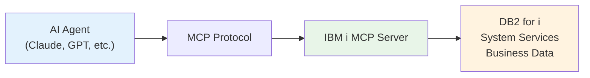
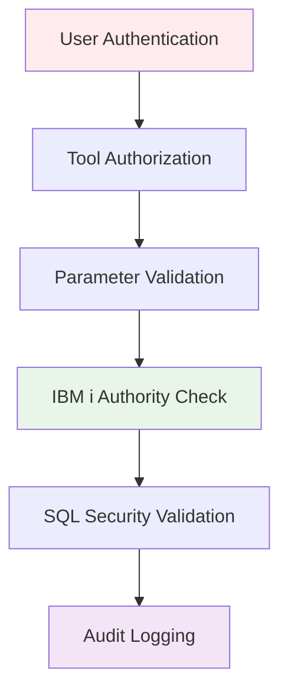

# Understanding the Model Context Protocol (MCP)

The Model Context Protocol (MCP) is an open standard that enables AI agents to securely access and interact with your data. For IBM i professionals, MCP provides a bridge between modern AI applications and enterprise systems while maintaining your security standards.

<Info>
**In Simple Terms**: MCP is like a standardized API that AI agents understand natively. Instead of building custom integrations for each AI tool, MCP provides a universal interface that works with any MCP-compatible agent.
</Info>

---

## The Problem MCP Solves

Traditional AI applications struggle with enterprise data access:

<CardGroup cols={2}>
  <Card title="Data Silos" icon="database">
    Enterprise data locked in systems that AI can't easily access
  </Card>
  <Card title="Security Risks" icon="shield-exclamation">
    Exposing sensitive data through broad API access or data exports
  </Card>
  <Card title="Integration Complexity" icon="network-wired">
    Building custom connectors for every AI tool and data source
  </Card>
  <Card title="Maintenance Burden" icon="wrench">
    Managing multiple integration points and authentication methods
  </Card>
</CardGroup>

**MCP's Solution**: A standardized, secure, and controlled way for AI agents to access exactly the data they need, when they need it.

---

## Why MCP Matters for IBM i

MCP is particularly valuable for IBM i environments because it:

### Preserves IBM i Security

MCP integrates with IBM i's comprehensive security system:

```
User JSMITH → MCP Server → DB2i (as JSMITH)
✓ Inherits JSMITH's authorities
✓ Audit trail maintained
✓ Object-level security enforced
```

AI agents can only access data that the authenticated user has permission to see.

### Enables Modern AI Workflows

Connect cutting-edge AI agents to decades of business-critical data without compromising security:

- **AI-powered business intelligence** and reporting
- **Automated system monitoring** and alerting
- **Intelligent data analysis** and trend identification
- **Natural language queries** against business data

### Maintains Enterprise Standards

- OpenTelemetry integration for observability
- Structured audit logging for compliance
- Rate limiting and resource protection
- Multi-environment configuration management

---

## How MCP Works

MCP creates a three-party interaction between your data, the MCP server, and AI agents:



### The Conversation Flow

<Steps>
  <Step title="Agent Request">
    AI agent identifies a need for data:
    ```json
    {
      "name": "query_active_jobs",
      "arguments": {
        "user_filter": "ACCOUNTING",
        "max_rows": 10
      }
    }
    ```
  </Step>

  <Step title="Server Processing">
    MCP server validates and executes:
    - ✅ Authentication check
    - ✅ Parameter validation
    - ✅ Authority verification
    - ✅ SQL execution with binding
    - ✅ Result formatting
  </Step>

  <Step title="Structured Response">
    Agent receives structured, actionable data:
    ```json
    {
      "content": "Found 8 active jobs for ACCOUNTING...",
      "structuredContent": {
        "jobs": [
          {"job_name": "PAYROLL01", "user": "ACCUSER1"},
          {"job_name": "REPORTS", "user": "ACCUSER2"}
        ]
      }
    }
    ```
  </Step>
</Steps>

---

## Key MCP Concepts

### Tools

**Tools** are discrete operations AI agents can perform. In IBM i, tools typically:

<Tabs>
  <Tab title="Query Data">
    ```yaml
    tools:
      system_status:
        description: "Get system performance metrics"
        statement: "SELECT * FROM qsys2.system_status_info"
    ```
  </Tab>

  <Tab title="Monitor Systems">
    ```yaml
    tools:
      check_subsystems:
        description: "List active subsystem status"
        statement: "SELECT * FROM qsys2.subsystem_info WHERE status = 'ACTIVE'"
    ```
  </Tab>

  <Tab title="Business Logic">
    ```yaml
    tools:
      calculate_inventory:
        description: "Run inventory calculation"
        statement: "CALL mylib.calc_inventory(:product_line)"
    ```
  </Tab>

  <Tab title="Generate Reports">
    ```yaml
    tools:
      monthly_sales:
        description: "Monthly sales summary"
        statement: "SELECT * FROM sales_summary WHERE month = :target_month"
    ```
  </Tab>
</Tabs>

### Resources

**Resources** provide static or semi-static content:
- Configuration files and documentation
- Reference data and lookup tables
- System catalogs and metadata
- Log files and audit trails

### Capabilities

MCP servers declare their **capabilities** to inform clients about supported features:

```json
{
  "capabilities": {
    "resources": { "listChanged": true },
    "tools": { "listChanged": true },
    "logging": {}
  }
}
```

---

## IBM i MCP Server Features

The IBM i MCP Server provides enterprise-grade capabilities:

<CardGroup cols={2}>
  <Card title="YAML SQL Tools" icon="file-code">
    Create database operations using simple YAML—no TypeScript required
  </Card>
  <Card title="IBM i Authentication" icon="key">
    Integrated authentication with RSA encryption for user profiles
  </Card>
  <Card title="Authority Integration" icon="shield-check">
    Respects IBM i object authorities and special authorities
  </Card>
  <Card title="Audit & Compliance" icon="clipboard-check">
    Comprehensive logging for regulatory compliance
  </Card>
  <Card title="Production Ready" icon="server">
    OpenTelemetry, error handling, operational monitoring
  </Card>
  <Card title="Multi-Transport" icon="arrows-alt">
    STDIO (development) and HTTP (production) support
  </Card>
</CardGroup>

---

## Security Model

MCP implements security based on **explicit consent and minimal access**:



### Security Principles

<AccordionGroup>
  <Accordion title="Least Privilege" icon="lock">
    AI agents only access tools explicitly made available:

    ```yaml
    toolsets:
      read_only_reports:
        tools: [sales_summary, inventory_levels]
        # No access to payroll or system admin tools
    ```
  </Accordion>

  <Accordion title="Authentication Required" icon="user-check">
    All access requires valid authentication:

    ```bash
    MCP_AUTH_MODE=ibmi
    IBMI_HTTP_AUTH_ENABLED=true
    ```

    Users authenticate before any tool access.
  </Accordion>

  <Accordion title="Transparent Audit Trail" icon="eye">
    All operations logged with full context:

    ```json
    {
      "timestamp": "2024-01-15T10:30:45.123Z",
      "user": "JSMITH",
      "tool": "query_customer_data",
      "parameters": {"customer_id": "12345"},
      "result": "success"
    }
    ```
  </Accordion>
</AccordionGroup>

---

## MCP vs. Traditional Approaches

<Tabs>
  <Tab title="vs. REST APIs">
    **Traditional REST:**
    - Custom integration for each AI tool
    - Broad API access often required
    - Complex per-endpoint authentication
    - Inconsistent security controls

    **MCP Advantages:**
    - Universal protocol for all clients
    - Granular tool-level access control
    - Built-in authentication/authorization
    - Standardized security model
  </Tab>

  <Tab title="vs. Direct Database">
    **Direct Database:**
    - AI tools need database credentials
    - Difficult to audit and control
    - No business logic abstraction
    - Credential management risks

    **MCP Advantages:**
    - No direct database access needed
    - User-level authentication
    - Business logic in tools
    - Comprehensive audit trails
  </Tab>

  <Tab title="vs. Data Exports">
    **Data Exports/ETL:**
    - Data becomes stale quickly
    - Full datasets for minimal needs
    - Complex pipeline maintenance
    - Compliance concerns

    **MCP Advantages:**
    - Real-time data access
    - Query only what's needed
    - No data duplication
    - Native IBM i security
  </Tab>
</Tabs>

<Note>
**MCP's Key Innovation**: AI agents become **intelligent participants** in your existing business processes rather than external tools needing special integration. They ask for specific data when needed, perform authorized operations, and maintain the same security standards as human users.
</Note>

---

## Common Questions

<AccordionGroup>
  <Accordion title="Will this compromise our IBM i security?" icon="shield-alt">
    **No.** MCP enhances security by providing controlled, audited access. AI agents authenticate as specific users and are subject to the same authority checking. All operations are logged and monitored.
  </Accordion>

  <Accordion title="Do we need to expose our database directly?" icon="database">
    **No.** The MCP server acts as a secure intermediary. Your database remains protected behind your firewall. The server only exposes specific, pre-defined operations you configure and control.
  </Accordion>

  <Accordion title="How does this affect system performance?" icon="tachometer-alt">
    MCP servers are designed for efficiency. SQL tools include row limiting, connection pooling, and resource management. You maintain full control over operations and execution.
  </Accordion>

  <Accordion title="What about compliance and audit requirements?" icon="gavel">
    MCP supports comprehensive audit logging including user identity, operations, parameters, and results. This often provides better audit trails than traditional approaches.
  </Accordion>

  <Accordion title="Can we integrate with existing monitoring?" icon="chart-line">
    **Yes.** The IBM i MCP Server includes OpenTelemetry for metrics/tracing, structured logging for SIEM integration, and health check endpoints for monitoring systems.
  </Accordion>
</AccordionGroup>

---

## Getting Started

<Steps>
  <Step title="Quick Start">
    Begin with the [Quick Start Guide](/quickstart) to get a server running and test your first tool
  </Step>

  <Step title="Understand Architecture">
    Review [Server Architecture](/concepts/architecture) to understand the SQL-as-tools approach
  </Step>

  <Step title="Create Tools">
    Follow the [SQL Tools Guide](/sql-tools/building-tools) to create custom tools using YAML
  </Step>

  <Step title="Build Agents">
    Explore [Agent Development](/agents/building-agents) to create AI agents for your business
  </Step>

  <Step title="Deploy">
    Use [Configuration Reference](/configuration) for production deployment settings
  </Step>
</Steps>

---

## Next Steps

<CardGroup cols={2}>
  <Card title="Quick Start" icon="rocket" href="/quickstart">
    Get your first MCP server running in 15 minutes
  </Card>
  <Card title="SQL Tools" icon="database" href="/sql-tools/overview">
    Learn how to create IBM i data access tools
  </Card>
  <Card title="Agent Development" icon="robot" href="/agents/building-agents">
    Build AI agents that understand your business
  </Card>
  <Card title="Client Integration" icon="plug" href="/clients/overview">
    Connect Claude, VSCode, or other MCP clients
  </Card>
</CardGroup>

<Note>
**The MCP Promise**: Instead of requiring you to adapt your systems for AI, MCP enables AI to work with your existing infrastructure, security models, and business processes. Your IBM i systems remain secure and performant while becoming accessible to modern AI agents.
</Note>
