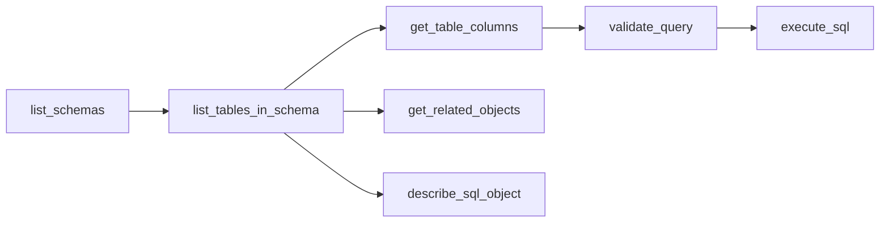

The IBM i MCP Server includes 7 built-in tools compiled directly into the server. These tools provide a complete text-to-SQL workflow out of the box — from schema discovery to query execution — without any YAML configuration or `--tools` flag.

<Note>
**Built-in vs YAML tools**: Built-in tools are TypeScript implementations compiled into the server binary. [YAML tools](/sql-tools/overview) are user-defined SQL queries loaded at runtime via `--tools`. Both types coexist and appear identically to AI agents.
</Note>

---

## Quick Start

Enable built-in tools with the `--builtin-tools` and `--execute-sql` flags:

```bash
# Set credentials
export DB2i_HOST="your-ibmi-system.local"
export DB2i_USER="YOURUSERID"
export DB2i_PASS="YourPassword"

# Start with full text-to-SQL workflow
npx -y @ibm/ibmi-mcp-server@latest --builtin-tools --execute-sql --transport http
```

- `--builtin-tools` enables the 5 schema discovery tools (`list_schemas`, `list_tables_in_schema`, `get_table_columns`, `get_related_objects`, `validate_query`)
- `--execute-sql` enables `execute_sql` for running queries
- `describe_sql_object` is always available regardless of flags

<Tip>
Use `--builtin-tools` without `--execute-sql` to let agents explore the schema but route query execution through curated [YAML tools](/sql-tools/overview) with parameterized queries and security controls.
</Tip>

---

## Recommended Workflow

The built-in tools are designed to be chained in a progressive discovery pattern:



<Steps>
  <Step title="Discover schemas">
    Use `list_schemas` to find available libraries/schemas on the system.
  </Step>
  <Step title="Browse tables">
    Use `list_tables_in_schema` to list tables, views, and physical files within a schema.
  </Step>
  <Step title="Inspect columns">
    Use `get_table_columns` to understand a table's structure before writing queries.
  </Step>
  <Step title="Check dependencies">
    Optionally use `get_related_objects` for impact analysis or `describe_sql_object` to view DDL.
  </Step>
  <Step title="Validate SQL">
    Use `validate_query` to check syntax and verify that referenced objects exist.
  </Step>
  <Step title="Execute query">
    Use `execute_sql` to run the validated query and retrieve results.
  </Step>
</Steps>

---

## Tool Reference

### list_schemas

List available schemas/libraries on the IBM i system. Use this as the first step in schema discovery to find which schemas contain relevant tables.

**Catalog view:** `QSYS2.SYSSCHEMAS`

#### Parameters

| Name | Type | Required | Default | Description |
|------|------|----------|---------|-------------|
| `filter` | string | No | — | Schema name pattern using SQL LIKE syntax (e.g., `'MY%'`, `'LIB%'`). Max 128 characters. |
| `include_system` | boolean | No | `false` | Include system schemas (Q* and SYS* prefixed). |
| `limit` | integer | No | `50` | Maximum rows to return (1–500). |
| `offset` | integer | No | `0` | Number of rows to skip for pagination. |

#### Response columns

| Column | Description |
|--------|-------------|
| `SCHEMA_NAME` | SQL schema name |
| `SCHEMA_TEXT` | Schema description text |
| `SYSTEM_SCHEMA_NAME` | System library name |
| `SCHEMA_SIZE` | Schema size in bytes |

<Tip>
**Pagination**: The response includes `hasMore: true` when additional rows are available beyond the current page. Increment `offset` by `limit` to fetch the next page.
</Tip>

---

### list_tables_in_schema

List tables, views, and physical files in a specific schema with metadata including row counts. Use after `list_schemas` to find tables before querying column details.

**Catalog views:** `QSYS2.SYSTABLES` joined with `QSYS2.SYSTABLESTAT`

#### Parameters

| Name | Type | Required | Default | Description |
|------|------|----------|---------|-------------|
| `schema_name` | string | **Yes** | — | Schema name to list tables from (1–128 characters). |
| `table_filter` | string | No | `*ALL` | Filter by name pattern using SQL LIKE syntax (e.g., `'CUST%'`). Use `'*ALL'` for all tables. Max 128 characters. |
| `limit` | integer | No | `50` | Maximum rows to return (1–500). |
| `offset` | integer | No | `0` | Number of rows to skip for pagination. |

#### Response columns

| Column | Description |
|--------|-------------|
| `TABLE_SCHEMA` | Schema containing the table |
| `TABLE_NAME` | Table name |
| `TABLE_TYPE` | `T` = Table, `V` = View, `P` = Physical file |
| `TABLE_TEXT` | Table description text |
| `NUMBER_ROWS` | Approximate row count |
| `COLUMN_COUNT` | Number of columns |

---

### get_table_columns

Get column metadata for a table including names, data types, lengths, nullability, defaults, and descriptions. Use this to understand table structure before writing SQL queries.

**Catalog view:** `QSYS2.SYSCOLUMNS2`

#### Parameters

| Name | Type | Required | Default | Description |
|------|------|----------|---------|-------------|
| `schema_name` | string | **Yes** | — | Schema containing the table (1–128 characters). |
| `table_name` | string | **Yes** | — | Table name to get columns for (1–128 characters). |

#### Response columns

| Column | Description |
|--------|-------------|
| `COLUMN_NAME` | SQL column name |
| `SYSTEM_COLUMN_NAME` | 10-character DDS column name |
| `DATA_TYPE` | SQL data type (VARCHAR, DECIMAL, etc.) |
| `LENGTH` | Column length |
| `NUMERIC_SCALE` | Decimal places (numeric columns) |
| `NUMERIC_PRECISION` | Total digits (numeric columns) |
| `IS_NULLABLE` | `Y` or `N` |
| `HAS_DEFAULT` | `Y` or `N` |
| `COLUMN_DEFAULT` | Default value expression |
| `COLUMN_TEXT` | Column description text |
| `COLUMN_HEADING` | DDS column heading |
| `ORDINAL_POSITION` | Position in table (1-based) |
| `CCSID` | Character set identifier |
| `HIDDEN` | `P` = implicitly hidden, `N` = visible |
| `IS_IDENTITY` | `YES` or `NO` |

<Note>
Null or undefined values are automatically stripped from each row to reduce response size. Only columns with values are included in the output.
</Note>

---

### get_related_objects

Get all objects that depend on a database file — views, indexes, triggers, foreign keys, logical files, and more. Use for impact analysis before schema changes or to understand a table's dependency graph.

**Catalog function:** `SYSTOOLS.RELATED_OBJECTS`

#### Parameters

| Name | Type | Required | Default | Description |
|------|------|----------|---------|-------------|
| `library_name` | string | **Yes** | — | Library containing the database file (1–10 characters). |
| `file_name` | string | **Yes** | — | System name of the database file (1–10 characters). |
| `object_type_filter` | enum | No | — | Filter to a specific dependent object type. Omit for all types. |

**Valid `object_type_filter` values:**

`ALIAS`, `FOREIGN KEY`, `FUNCTION`, `HISTORY TABLE`, `INDEX`, `KEYED LOGICAL FILE`, `LOGICAL FILE`, `MASK`, `MATERIALIZED QUERY TABLE`, `PERMISSION`, `PROCEDURE`, `TEXT INDEX`, `TRIGGER`, `VARIABLE`, `VIEW`, `XML SCHEMA`

#### Response columns

| Column | Description |
|--------|-------------|
| `SOURCE_SCHEMA_NAME` | Schema of the referenced object |
| `SOURCE_SQL_NAME` | Name of the referenced object |
| `SQL_OBJECT_TYPE` | Type of the dependent object |
| `SCHEMA_NAME` | Schema of the dependent object |
| `SQL_NAME` | Name of the dependent object |
| `LIBRARY_NAME` | System library name |
| `SYSTEM_NAME` | System object name |
| `OBJECT_OWNER` | Object owner profile |
| `LONG_COMMENT` | Long comment text |
| `OBJECT_TEXT` | Object text description |
| `LAST_ALTERED` | Last modification timestamp |

---

### validate_query

Validate SQL query syntax and verify that referenced tables, columns, functions, and procedures exist in the system catalog. This tool performs multi-step validation:

1. **Syntax check** — Uses `QSYS2.PARSE_STATEMENT` to parse the SQL statement
2. **Table verification** — Cross-references parsed table names against `QSYS2.SYSTABLES`
3. **Column verification** — Checks columns against `QSYS2.SYSCOLUMNS`
4. **Routine verification** — Verifies functions/procedures against `QSYS2.SYSROUTINES`

#### Parameters

| Name | Type | Required | Default | Description |
|------|------|----------|---------|-------------|
| `sql_statement` | string | **Yes** | — | SQL statement to validate (5–10,000 characters). |

#### Response structure

```json
{
  "data": [ /* PARSE_STATEMENT result rows */ ],
  "objectValidation": {
    "tables": {
      "valid": [{ "TABLE_SCHEMA": "...", "TABLE_NAME": "..." }],
      "invalid": [{ "TABLE_SCHEMA": "...", "TABLE_NAME": "..." }]
    },
    "columns": {
      "valid": [{ "TABLE_SCHEMA": "...", "TABLE_NAME": "...", "COLUMN_NAME": "..." }],
      "invalid": [{ "TABLE_SCHEMA": "...", "TABLE_NAME": "...", "COLUMN_NAME": "..." }]
    },
    "routines": {
      "valid": [{ "ROUTINE_SCHEMA": "...", "ROUTINE_NAME": "..." }],
      "invalid": [{ "ROUTINE_SCHEMA": "...", "ROUTINE_NAME": "..." }]
    }
  }
}
```

<Warning>
**Confidence levels**: Table validation is high-confidence — invalid tables will definitely cause query failures. Column and routine validation is advisory — CTE columns, UDTF outputs, and unqualified references may appear as false positives.
</Warning>

---

### execute_sql

Execute a SQL query on the IBM i database and return the results. Use this after validating your query with `validate_query`.

#### Parameters

| Name | Type | Required | Default | Description |
|------|------|----------|---------|-------------|
| `sql` | string | **Yes** | — | The SQL query to execute (1–10,000 characters). |

#### Response structure

```json
{
  "data": [ /* result rows */ ],
  "rowCount": 42,
  "executionTime": 156,
  "metadata": {
    "columns": [
      { "name": "COLUMN_NAME", "type": "VARCHAR" }
    ]
  }
}
```

#### Security

`execute_sql` applies two layers of validation before running any query:

1. **AST/regex validation** via `SqlSecurityValidator` — checks read-only mode constraints and query length
2. **Native IBM i validation** via `QSYS2.PARSE_STATEMENT` — confirms `SQL_STATEMENT_TYPE = 'QUERY'` when in read-only mode

<Note>
By default, only SELECT queries are allowed (`IBMI_EXECUTE_SQL_READONLY=true`). Set `IBMI_EXECUTE_SQL_READONLY=false` to allow INSERT, UPDATE, DELETE, and other statement types.
</Note>

---

### describe_sql_object

Generate the SQL DDL statement for an IBM i database object. Use this to see the full CREATE definition of a table, view, index, procedure, function, or other object.

**Catalog procedure:** `QSYS2.GENERATE_SQL`

#### Parameters

| Name | Type | Required | Default | Description |
|------|------|----------|---------|-------------|
| `object_name` | string | **Yes** | — | Name of the database object (1–128 characters). |
| `object_library` | string | No | `QSYS2` | Library where the object is located (1–128 characters). |
| `object_type` | enum | No | `TABLE` | Type of database object. |

**Valid `object_type` values:**

`ALIAS`, `CONSTRAINT`, `FUNCTION`, `INDEX`, `MASK`, `PERMISSION`, `PROCEDURE`, `SCHEMA`, `SEQUENCE`, `TABLE`, `TRIGGER`, `TYPE`, `VARIABLE`, `VIEW`, `XSR`

#### Response structure

```json
{
  "sql": "CREATE OR REPLACE TABLE ...",
  "object_name": "MYTABLE",
  "object_library": "MYLIB",
  "object_type": "TABLE",
  "executionTime": 230
}
```

---

## Pagination

Tools that support pagination (`list_schemas`, `list_tables_in_schema`) use a consistent pattern:

| Parameter | Description |
|-----------|-------------|
| `limit` | Maximum rows per page (default 50, max 500) |
| `offset` | Rows to skip (default 0) |

The response includes a `hasMore` boolean indicating whether additional pages exist. To paginate:

```
Page 1: limit=50, offset=0   → hasMore: true
Page 2: limit=50, offset=50  → hasMore: true
Page 3: limit=50, offset=100 → hasMore: false (last page)
```

<Tip>
The server internally fetches `limit + 1` rows to determine `hasMore`, then returns only `limit` rows. This avoids an extra count query.
</Tip>

---

## Configuration

Built-in tools are controlled via CLI flags or environment variables. CLI flags take precedence over environment variables.

### CLI Flags

| Flag | Description |
|------|-------------|
| `--builtin-tools` | Enable the 5 schema discovery tools |
| `--execute-sql` | Enable the `execute_sql` tool |

Combine both flags for the complete text-to-SQL workflow. Each flag can also be used independently.

### Environment Variables

| Variable | Default | Description |
|----------|---------|-------------|
| `IBMI_ENABLE_DEFAULT_TOOLS` | `false` | Enable the 5 schema discovery tools. |
| `IBMI_ENABLE_EXECUTE_SQL` | `false` | Enable the `execute_sql` tool. |
| `IBMI_EXECUTE_SQL_READONLY` | `true` | When `true`, `execute_sql` only allows SELECT queries. Set to `false` to permit data modification statements. |

<Warning>
`describe_sql_object` is **always registered** regardless of these flags. It generates DDL definitions and does not modify data.
</Warning>

### Examples

```bash
# Full text-to-SQL workflow (schema discovery + query execution)
npx -y @ibm/ibmi-mcp-server@latest --builtin-tools --execute-sql --transport http

# Schema discovery only (agents explore but can't run arbitrary SQL)
npx -y @ibm/ibmi-mcp-server@latest --builtin-tools --tools ./tools

# Execute SQL only alongside YAML tools
npx -y @ibm/ibmi-mcp-server@latest --execute-sql --tools ./tools

# Only YAML tools (default — no built-in tools)
npx -y @ibm/ibmi-mcp-server@latest --transport http --tools ./tools

# Enable write access for execute_sql
IBMI_EXECUTE_SQL_READONLY=false npx -y @ibm/ibmi-mcp-server@latest --builtin-tools --execute-sql
```

---

## Tool Annotations

All built-in tools include [MCP tool annotations](https://modelcontextprotocol.io/specification) that help AI agents understand tool behavior:

| Tool | `readOnlyHint` | `destructiveHint` |
|------|---------------|-------------------|
| `list_schemas` | `true` | `false` |
| `list_tables_in_schema` | `true` | `false` |
| `get_table_columns` | `true` | `false` |
| `get_related_objects` | `true` | `false` |
| `validate_query` | `true` | `false` |
| `execute_sql` | Dynamic* | Dynamic* |
| `describe_sql_object` | `true` | `false` |

*`execute_sql` annotations change based on `IBMI_EXECUTE_SQL_READONLY`: when `true` (default), `readOnlyHint=true` and `destructiveHint=false`; when `false`, `readOnlyHint=false` and `destructiveHint=true`.

---

## Next Steps

<CardGroup cols={2}>
  <Card title="YAML Tools Overview" icon="wrench" href="/sql-tools/overview">
    Build custom SQL tools with zero TypeScript using YAML configuration
  </Card>
  <Card title="Using Default YAML Tools" icon="box-open" href="/sql-tools/using-default-tools">
    Load pre-built YAML tool collections for system admin, security, and performance
  </Card>
  <Card title="Quickstart" icon="rocket" href="/quickstart">
    Get the server running with your first AI agent
  </Card>
  <Card title="Server Configuration" icon="gear" href="/configuration">
    Complete environment variable and server configuration reference
  </Card>
</CardGroup>
