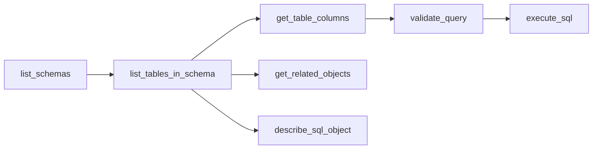

The IBM i MCP Server includes 7 built-in tools compiled directly into the server. These tools provide a complete text-to-SQL workflow out of the box — from schema discovery to query execution — without any YAML configuration or `--tools` flag.

<Note>
**Built-in vs YAML tools**: Built-in tools are TypeScript implementations compiled into the server binary. [YAML tools](/sql-tools/overview) are user-defined SQL queries loaded at runtime via `--tools`. Both types coexist and appear identically to AI agents.
</Note>

---

## Quick Start

Enable built-in tools with the `--builtin-tools` and `--execute-sql` flags:

```bash
# Set credentials
export DB2i_HOST="your-ibmi-system.local"
export DB2i_USER="YOURUSERID"
export DB2i_PASS="YourPassword"

# Start with full text-to-SQL workflow
npx -y @ibm/ibmi-mcp-server@latest --builtin-tools --execute-sql --transport http
```

- `--builtin-tools` enables the 5 schema discovery tools (`list_schemas`, `list_tables_in_schema`, `get_table_columns`, `get_related_objects`, `validate_query`)
- `--execute-sql` enables `execute_sql` for running queries
- `describe_sql_object` is always available regardless of flags

<Tip>
Use `--builtin-tools` without `--execute-sql` to let agents explore the schema but route query execution through curated [YAML tools](/sql-tools/overview) with parameterized queries and security controls.
</Tip>

---

## Recommended Workflow

The built-in tools are designed to be chained in a progressive discovery pattern:


```mermaid
flowchart LR
    A[list_schemas] --> B[list_tables_in_schema]
    B --> C[get_table_columns]
    C --> D[validate_query]
    D --> E[execute_sql]
    B --> F[get_related_objects]
    B --> G[describe_sql_object]
```

<Steps>
  <Step title="Discover schemas">
    Use `list_schemas` to find available libraries/schemas on the system.
  </Step>
  <Step title="Browse tables">
    Use `list_tables_in_schema` to list tables, views, and physical files within a schema.
  </Step>
  <Step title="Inspect columns">
    Use `get_table_columns` to understand a table's structure before writing queries.
  </Step>
  <Step title="Check dependencies">
    Optionally use `get_related_objects` for impact analysis or `describe_sql_object` to view DDL.
  </Step>
  <Step title="Validate SQL">
    Use `validate_query` to check syntax and verify that referenced objects exist.
  </Step>
  <Step title="Execute query">
    Use `execute_sql` to run the validated query and retrieve results.
  </Step>
</Steps>

---

## Tool Reference

### list_schemas

List available schemas/libraries on the IBM i system. Use this as the first step in schema discovery to find which schemas contain relevant tables.

**Catalog view:** `QSYS2.SYSSCHEMAS`

#### Parameters

| Name | Type | Required | Default | Description |
|------|------|----------|---------|-------------|
| `filter` | string | No | — | Schema name pattern using SQL LIKE syntax (e.g., `'MY%'`, `'LIB%'`). Max 128 characters. |
| `include_system` | boolean | No | `false` | Include system schemas (Q* and SYS* prefixed). |
| `limit` | integer | No | `50` | Maximum rows to return (1–500). |
| `offset` | integer | No | `0` | Number of rows to skip for pagination. |

#### Response columns

| Column | Description |
|--------|-------------|
| `SCHEMA_NAME` | SQL schema name |
| `SCHEMA_TEXT` | Schema description text |
| `SYSTEM_SCHEMA_NAME` | System library name |
| `SCHEMA_SIZE` | Schema size in bytes |

<Tip>
**Pagination**: The response includes `hasMore: true` when additional rows are available beyond the current page. Increment `offset` by `limit` to fetch the next page.
</Tip>

---

### list_tables_in_schema

List tables, views, and physical files in a specific schema with metadata including row counts. Use after `list_schemas` to find tables before querying column details.

**Catalog views:** `QSYS2.SYSTABLES` joined with `QSYS2.SYSTABLESTAT`

#### Parameters

| Name | Type | Required | Default | Description |
|------|------|----------|---------|-------------|
| `schema_name` | string | **Yes** | — | Schema name to list tables from (1–128 characters). |
| `table_filter` | string | No | `*ALL` | Filter by name pattern using SQL LIKE syntax (e.g., `'CUST%'`). Use `'*ALL'` for all tables. Max 128 characters. |
| `limit` | integer | No | `50` | Maximum rows to return (1–500). |
| `offset` | integer | No | `0` | Number of rows to skip for pagination. |

#### Response columns

| Column | Description |
|--------|-------------|
| `TABLE_SCHEMA` | Schema containing the table |
| `TABLE_NAME` | Table name |
| `TABLE_TYPE` | `T` = Table, `V` = View, `P` = Physical file |
| `TABLE_TEXT` | Table description text |
| `NUMBER_ROWS` | Approximate row count |
| `COLUMN_COUNT` | Number of columns |

---

### get_table_columns

Get column metadata for a table including names, data types, lengths, nullability, defaults, and descriptions. Use this to understand table structure before writing SQL queries.

**Catalog view:** `QSYS2.SYSCOLUMNS2`

#### Parameters

| Name | Type | Required | Default | Description |
|------|------|----------|---------|-------------|
| `schema_name` | string | **Yes** | — | Schema containing the table (1–128 characters). |
| `table_name` | string | **Yes** | — | Table name to get columns for (1–128 characters). |

#### Response columns

| Column | Description |
|--------|-------------|
| `COLUMN_NAME` | SQL column name |
| `SYSTEM_COLUMN_NAME` | 10-character DDS column name |
| `DATA_TYPE` | SQL data type (VARCHAR, DECIMAL, etc.) |
| `LENGTH` | Column length |
| `NUMERIC_SCALE` | Decimal places (numeric columns) |
| `NUMERIC_PRECISION` | Total digits (numeric columns) |
| `IS_NULLABLE` | `Y` or `N` |
| `HAS_DEFAULT` | `Y` or `N` |
| `COLUMN_DEFAULT` | Default value expression |
| `COLUMN_TEXT` | Column description text |
| `COLUMN_HEADING` | DDS column heading |
| `ORDINAL_POSITION` | Position in table (1-based) |
| `CCSID` | Character set identifier |
| `HIDDEN` | `P` = implicitly hidden, `N` = visible |
| `IS_IDENTITY` | `YES` or `NO` |

<Note>
Null or undefined values are automatically stripped from each row to reduce response size. Only columns with values are included in the output.
</Note>

---

### get_related_objects

Get all objects that depend on a database file — views, indexes, triggers, foreign keys, logical files, and more. Use for impact analysis before schema changes or to understand a table's dependency graph.

**Catalog function:** `SYSTOOLS.RELATED_OBJECTS`

#### Parameters

| Name | Type | Required | Default | Description |
|------|------|----------|---------|-------------|
| `library_name` | string | **Yes** | — | Library containing the database file (1–10 characters). |
| `file_name` | string | **Yes** | — | System name of the database file (1–10 characters). |
| `object_type_filter` | enum | No | — | Filter to a specific dependent object type. Omit for all types. |

**Valid `object_type_filter` values:**

`ALIAS`, `FOREIGN KEY`, `FUNCTION`, `HISTORY TABLE`, `INDEX`, `KEYED LOGICAL FILE`, `LOGICAL FILE`, `MASK`, `MATERIALIZED QUERY TABLE`, `PERMISSION`, `PROCEDURE`, `TEXT INDEX`, `TRIGGER`, `VARIABLE`, `VIEW`, `XML SCHEMA`

#### Response columns

| Column | Description |
|--------|-------------|
| `SOURCE_SCHEMA_NAME` | Schema of the referenced object |
| `SOURCE_SQL_NAME` | Name of the referenced object |
| `SQL_OBJECT_TYPE` | Type of the dependent object |
| `SCHEMA_NAME` | Schema of the dependent object |
| `SQL_NAME` | Name of the dependent object |
| `LIBRARY_NAME` | System library name |
| `SYSTEM_NAME` | System object name |
| `OBJECT_OWNER` | Object owner profile |
| `LONG_COMMENT` | Long comment text |
| `OBJECT_TEXT` | Object text description |
| `LAST_ALTERED` | Last modification timestamp |

---

### validate_query

Validate SQL query syntax and verify that referenced tables, columns, functions, and procedures exist in the system catalog. This tool performs multi-step validation:

1. **Syntax check** — Uses `QSYS2.PARSE_STATEMENT` to parse the SQL statement
2. **Table verification** — Cross-references parsed table names against `QSYS2.SYSTABLES`
3. **Column verification** — Checks columns against `QSYS2.SYSCOLUMNS`
4. **Routine verification** — Verifies functions/procedures against `QSYS2.SYSROUTINES`

#### Parameters

| Name | Type | Required | Default | Description |
|------|------|----------|---------|-------------|
| `sql_statement` | string | **Yes** | — | SQL statement to validate (5–10,000 characters). |

#### Response structure

```json
{
  "data": [ /* PARSE_STATEMENT result rows */ ],
  "objectValidation": {
    "tables": {
      "valid": [{ "TABLE_SCHEMA": "...", "TABLE_NAME": "..." }],
      "invalid": [{ "TABLE_SCHEMA": "...", "TABLE_NAME": "..." }]
    },
    "columns": {
      "valid": [{ "TABLE_SCHEMA": "...", "TABLE_NAME": "...", "COLUMN_NAME": "..." }],
      "invalid": [{ "TABLE_SCHEMA": "...", "TABLE_NAME": "...", "COLUMN_NAME": "..." }]
    },
    "routines": {
      "valid": [{ "ROUTINE_SCHEMA": "...", "ROUTINE_NAME": "..." }],
      "invalid": [{ "ROUTINE_SCHEMA": "...", "ROUTINE_NAME": "..." }]
    }
  }
}
```

<Warning>
**Confidence levels**: Table validation is high-confidence — invalid tables will definitely cause query failures. Column and routine validation is advisory — CTE columns, UDTF outputs, and unqualified references may appear as false positives.
</Warning>

---

### execute_sql

Execute one SQL statement on the IBM i database and return the results. Which statements are accepted depends on the guardrail mode (`read`, `read-call`, or `write`); see [Execute SQL guardrails](#execute-sql-guardrails). The tool's description tells the agent which statements the current mode accepts.

#### Parameters

| Name | Type | Required | Default | Description |
|------|------|----------|---------|-------------|
| `sql` | string | **Yes** | — | The SQL query to execute (1–10,000 characters). |

#### Response structure

```json
{
  "data": [ /* result rows */ ],
  "rowCount": 42,
  "executionTime": 156,
  "metadata": {
    "columns": [
      { "name": "COLUMN_NAME", "type": "VARCHAR" }
    ]
  }
}
```

A trailing `;` is removed before the statement is checked and run.

#### Guardrails

Before the statement is sent to IBM i, `execute_sql` checks it against the guardrail mode set by `IBMI_EXECUTE_SQL_ACCESS` (default `read`). A statement the guardrail rejects is not sent; the tool returns an error result (`isError: true`) that names the mode, the rule, and the lowest mode that would allow the statement. A statement that passes runs as the IBM i user profile in `DB2i_USER`, and that profile's authority decides what it can do. See [Execute SQL guardrails](#execute-sql-guardrails).

---

### describe_sql_object

Generate the SQL DDL statement for an IBM i database object. Use this to see the full CREATE definition of a table, view, index, procedure, function, or other object.

**Catalog procedure:** `QSYS2.GENERATE_SQL`

#### Parameters

| Name | Type | Required | Default | Description |
|------|------|----------|---------|-------------|
| `object_name` | string | **Yes** | — | Name of the database object (1–128 characters). |
| `object_library` | string | No | `QSYS2` | Library where the object is located (1–128 characters). |
| `object_type` | enum | No | `TABLE` | Type of database object. |

**Valid `object_type` values:**

`ALIAS`, `CONSTRAINT`, `FUNCTION`, `INDEX`, `MASK`, `PERMISSION`, `PROCEDURE`, `SCHEMA`, `SEQUENCE`, `TABLE`, `TRIGGER`, `TYPE`, `VARIABLE`, `VIEW`, `XSR`

#### Response structure

```json
{
  "sql": "CREATE OR REPLACE TABLE ...",
  "object_name": "MYTABLE",
  "object_library": "MYLIB",
  "object_type": "TABLE",
  "executionTime": 230
}
```

---

## Execute SQL guardrails

`execute_sql` has three guardrails: `read`, `read-call`, and `write`. One of them is in effect at a time, set by `IBMI_EXECUTE_SQL_ACCESS` (default `read`). The guardrail checks the SQL text of each statement before the server sends it to IBM i.

<Warning>
**The guardrails are not the security boundary. The IBM i user profile is.** `execute_sql` runs every statement as the profile in `DB2i_USER` (the `ibmi sql` CLI uses the system's `user`). Db2 for i and IBM i object authority decide what the statement can read or change. The guardrails reject statements by their SQL text; they cannot see what a function, procedure, view, or trigger does when it runs. Connect with a profile that can do only what you are willing to let an agent do. See [Configure a least-privilege profile](#configure-a-least-privilege-profile).
</Warning>

### The three modes

| Mode | Statement types allowed | Also rejected in this mode | JDBC `access` |
|------|-------------------------|----------------------------|---------------|
| `read` (default) | Queries: `SELECT`, `WITH`, `VALUES` | Data-change table references such as `SELECT * FROM FINAL TABLE (INSERT ...)`; sequence references (`NEXT VALUE FOR`, `PREVIOUS VALUE FOR`); functions that match `IBMI_EXECUTE_SQL_FORBIDDEN_FUNCTIONS` (default `QCMDEXC`) | `read call` |
| `read-call` | Queries and `CALL` | Any table used as the target of `INSERT`, `UPDATE`, `DELETE`, or `MERGE`, including inside `FINAL TABLE (...)` | `read call` |
| `write` | Every statement type | Nothing beyond the length limit and forbidden keywords | `all` |

In `read` and `read-call`, every other statement type is rejected: `INSERT`, `UPDATE`, `DELETE`, `MERGE`, DDL (`CREATE`, `ALTER`, `DROP`, ...), `SET`, `COMMIT`, `ROLLBACK`, compound statements, and input with more than one statement. `read` also rejects `CALL`. Every mode rejects a statement longer than 10,000 characters and any statement that matches a [forbidden keyword](#forbidden-keywords-every-mode).

**`read`** accepts queries whose SQL text has no side effects. It does not make the connection read-only. A function that is not on the forbidden-functions list can still have side effects when it runs. Examples on IBM i 7.4 include `HTTP_POST`, `MQRECEIVE`, `RECEIVE_DATA_QUEUE`, `IFS_UNLINK`, and `CHANGE_USER_PROFILE`, and any user-defined function declared `MODIFIES SQL DATA`. To reject such functions in `read`, add them to `IBMI_EXECUTE_SQL_FORBIDDEN_FUNCTIONS`. To prevent their effects, deny the profile authority to them.

**`read-call`** adds `CALL` and removes the function and sequence checks. A procedure runs with the profile's authority, and the guardrail does not look inside it. `CALL QSYS2.QCMDEXC('...')` runs any CL command the profile is authorized to, including `RUNSQL`, which runs any SQL statement. A `read-call` agent can therefore do anything the profile can do; `read-call` limits only the statements the agent sends directly.

**`write`** applies only the length limit and the forbidden-keywords gate, and never calls `PARSE_STATEMENT`. What a statement can change is decided by the profile's authority alone.

### How a statement is checked

<Steps>
  <Step title="Length limit">
    Statements longer than 10,000 characters are rejected in every mode.
  </Step>
  <Step title="Forbidden keywords">
    Patterns in `IBMI_EXECUTE_SQL_FORBIDDEN_KEYWORDS` are checked in every mode, including `write`. In `write`, the statement is then sent to IBM i.
  </Step>
  <Step title="Quick path (read and read-call)">
    The server's built-in Db2 for i parser checks the statement in-process. It approves the statement only when all of the following hold:

    - The input is one statement of plain ASCII text. It has no block comments (`/* */`), JDBC escapes (`{ }`), `U&` literals, `;` separators, delimited names that contain characters other than letters, digits, spaces, and `_ $ # @`, a word written directly against a quote (such as `DISTINCT"NAME"`; the literal prefixes in `X'41'` and `GX'...'` are fine), or any of the characters `! ^ ~ [ ] \` and backtick.
    - The statement starts with the keyword `SELECT`, `WITH`, or `VALUES`, or with `CALL` in `read-call` (a delimited `"SELECT"` is a name, not the keyword).
    - None of these appear outside string literals and comments: `INSERT`, `UPDATE`, `DELETE`, `MERGE`, `INTO`, `FINAL TABLE`, `NEW TABLE`, `OLD TABLE`, or `CALL` after the first word. In `read`, also `NEXTVAL`, `PREVVAL`, `VALUE FOR`, and any name that matches a forbidden-function pattern.

    The quick path rejects a plain single statement that starts with `CALL` (in `read`) or with a keyword that never starts a query: `INSERT`, `UPDATE`, `DELETE`, `MERGE`, `TRUNCATE`, `CREATE`, `ALTER`, `DROP`, `RENAME`, `GRANT`, `REVOKE`, `DECLARE`, `SET`, `COMMIT`, `ROLLBACK`, `LOCK`, or `REFRESH`.

    Every other statement goes to the slow path. A word such as `UPDATE` in a query does not reject the query; it only means `PARSE_STATEMENT` decides. The quick path does not check syntax: a malformed query can pass it, and Db2 then rejects the statement when it runs.
  </Step>
  <Step title="Slow path: QSYS2.PARSE_STATEMENT">
    The server makes one call to [`QSYS2.PARSE_STATEMENT`](https://www.ibm.com/docs/en/i/7.5?topic=services-parse-statement-table-function) with the statement as a bound parameter, on the same connection pool the statement would run on, using the connection's naming and decimal point. `PARSE_STATEMENT` parses the statement and lists every object it references and how each is used. It does not run the statement. The statement is rejected when:

    - `PARSE_STATEMENT` returns no rows: a syntax error, more than one statement, or a statement that references no objects;
    - `PARSE_STATEMENT` returns more than 10,000 rows (one per name reference), so its result is not complete;
    - a statement type is not allowed in the mode (`read`: `QUERY`; `read-call`: `QUERY` or `CALL`);
    - an object is used other than for a query, for example as the `TARGET TABLE` of an insert (in `read-call`, the procedure named by the `CALL` is allowed);
    - in `read`, a sequence is referenced (`NEXT VALUE FOR` and `PREVIOUS VALUE FOR` look the same to `PARSE_STATEMENT`, so both are rejected), or a function matches a forbidden-function pattern.

    If the `PARSE_STATEMENT` call itself fails, for example because the connection is lost, the statement is not run and the tool returns that error unchanged.
  </Step>
</Steps>

The quick path approves only statements that the `PARSE_STATEMENT` rules would also allow; the exception is plain queries for which `PARSE_STATEMENT` returns no rows, such as `VALUES 1`, which cannot write anything. A test corpus of 667 statements, labelled by `PARSE_STATEMENT` on IBM i 7.4, checks this in the test suite.

**Latency.** The quick path runs in-process and takes microseconds. The slow path adds one round trip to IBM i. On an IBM i 7.4 test system this was about 35–45 ms on a connection that had already run a statement, and about 170–260 ms when `PARSE_STATEMENT` was the first statement in a new job, which is the case for each `ibmi sql` invocation. Plain `SELECT` statements usually take the quick path. `write` never calls `PARSE_STATEMENT`.

**Statements with no referenced objects.** A statement that goes to the slow path and references no table, view, function, or sequence is rejected, because `PARSE_STATEMENT` returns no rows for it. For example, `/* check */ VALUES 1` is rejected, while `VALUES 1` is approved on the quick path. Remove the block comment, or select from `SYSIBM.SYSDUMMY1`.

### Optional gates

Two optional gates add rejections on top of the mode.

#### Forbidden functions (`read` only)

`IBMI_EXECUTE_SQL_FORBIDDEN_FUNCTIONS` is a comma-separated list of function name patterns. In `read`, a statement that calls a matching function is rejected.

- Unset, the list is `QCMDEXC`, which blocks the SQL function form of `QSYS2.QCMDEXC` that runs CL commands from a query.
- Setting the variable replaces the default. Include `QCMDEXC` in your list to keep it.
- An empty value (`IBMI_EXECUTE_SQL_FORBIDDEN_FUNCTIONS=`) turns the gate off. A line with nothing after `=` in `.env` counts as empty.
- `*` matches any run of characters. Matching is case-insensitive and covers the whole name.
- A pattern is compared with the function name, and with `SCHEMA.NAME` when the call is qualified. Use unqualified patterns: the name of an unqualified call is not resolved through the SQL path, so the pattern `QSYS2.QCMDEXC` does not match the call `QCMDEXC(...)`.
- The gate does not apply in `read-call` or `write`.
- A pattern that also matches a table or column name sends statements that use that name to `PARSE_STATEMENT`, which costs latency but does not reject them.

```bash
IBMI_EXECUTE_SQL_FORBIDDEN_FUNCTIONS=QCMDEXC,HTTP_POST*,MQRECEIVE*,RECEIVE_DATA_QUEUE,IFS_UNLINK,CHANGE_USER_PROFILE
```

#### Forbidden keywords (every mode)

`IBMI_EXECUTE_SQL_FORBIDDEN_KEYWORDS` is a comma-separated list of patterns rejected in every mode, including `write`. The default is empty.

- Patterns are compared with each keyword and identifier in the statement, and with each qualified name as `SCHEMA.NAME`. A name written with system naming (`SCHEMA/NAME`) is compared as `SCHEMA.NAME`. Delimited identifiers are compared without their quotes.
- String literals and comments are not checked.
- `*` matches any run of characters. Matching is case-insensitive and covers the whole token: `DROP` matches the keyword `DROP` but not a column named `DROP_DATE`.
- The `ibmi sql` CLI adds each system's `forbiddenKeywords` to this list.

```bash
IBMI_EXECUTE_SQL_FORBIDDEN_KEYWORDS=DROP,TRUNCATE,PAYROLL.*
```

This gate matches words, not effects. A procedure, a function, or a CL command run through `QCMDEXC` can reach the same operation without the word appearing in the statement.

### Setting the mode

| Variable | Default | Description |
|----------|---------|-------------|
| `IBMI_EXECUTE_SQL_ACCESS` | `read` | `read`, `read-call`, or `write`. When set, it is a ceiling: the `ibmi sql --access` flag and runtime configuration can lower the mode, never raise it. An unrecognized value, including an empty one, is treated as `read` (which also becomes the ceiling) and a warning is printed to stderr. |
| `IBMI_EXECUTE_SQL_READONLY` | — | **Deprecated.** Used only when `IBMI_EXECUTE_SQL_ACCESS` is not set. `false` or `0` selects `write`; any other value selects `read`. It sets the default only, never a ceiling, and prints a deprecation notice to stderr. |
| `IBMI_EXECUTE_SQL_FORBIDDEN_FUNCTIONS` | `QCMDEXC` | See [Forbidden functions](#forbidden-functions-read-only). |
| `IBMI_EXECUTE_SQL_FORBIDDEN_KEYWORDS` | (empty) | See [Forbidden keywords](#forbidden-keywords-every-mode). |

The mode is fixed when the server starts. Restart the server after changing these variables.

### Rejections

A rejected statement is not sent to IBM i. The tool returns an error result (`isError: true`). The message names the mode, what was found, and the lowest mode that would allow the statement:

```text
Error: execute_sql read guardrail rejected the statement: statement type INSERT is not allowed. The write guardrail mode allows it.
```

`structuredContent.details` carries the same information for programs:

| Field | Description |
|-------|-------------|
| `access` | The mode in effect |
| `rule` | `max-length`, `forbidden-keyword`, `statement-type`, `write-usage`, `sequence`, `forbidden-function`, or `unverifiable` (`PARSE_STATEMENT` returned no rows or an incomplete result) |
| `offending` | The keyword, statement type, or object name that caused the rejection |
| `lowestMode` | The lowest mode that allows the statement, or `null` when no mode does (length limit, forbidden keywords) |
| `validatedBy` | `quick` or `parse_statement` |
| `query` | The first 100 characters of the statement |

Errors from Db2 when a statement runs, such as a missing authority, are returned in the response with `success: false`.

### JDBC access property

The connection pool shared by `execute_sql` and the other built-in tools sets the JDBC `access` property from the mode: `read call` for `read` and `read-call`, and `all` for `write`. `read` uses `read call` because the `describe_sql_object` tool calls `QSYS2.GENERATE_SQL`.

This property is a check in the IBM Toolbox for Java JDBC driver inside the Mapepire server. It looks only at the first keyword of a statement. Db2 for i does not enforce it, and it does not stop a query that writes through a data-change table reference or a function. An `access=` value in `DB2i_JDBC_OPTIONS` overrides the derived value, and the server logs a warning when the two differ. Pools created from YAML sources are not affected.

### Annotations by mode

| Mode | `readOnlyHint` | `destructiveHint` | `openWorldHint` |
|------|----------------|-------------------|-----------------|
| `read` | `true` | `false` | `false` |
| `read-call` | `false` | `true` | `true` |
| `write` | `false` | `true` | `true` |

Some MCP clients run tools marked `readOnlyHint: true` without asking the user. The hint describes the guardrail, not the profile. Allow automatic approval only when the profile is limited as described below.

### What no guardrail can see

The guardrails check the SQL text. They cannot see:

- what a user-defined or external function or procedure does when it runs, whatever its name or declared data access;
- IBM-supplied functions with side effects that are not on the forbidden-functions list;
- functions called from inside a view, and triggers that fire on a table;
- anything a procedure does in `read-call`;
- job state. The server reuses pooled jobs, so a change made by one statement stays for later statements from any built-in tool on that pool: objects in `QTEMP`, overrides such as `OVRDBF ... OVRSCOPE(*JOB)` run through `QCMDEXC`, the library list, and special registers.

`execute_sql` and the other built-in tools always run as `DB2i_USER`, also when IBM i HTTP authentication is enabled. Per-user connections under HTTP authentication apply to YAML tools only.

### Configure a least-privilege profile

<Note>
This is guidance, not a validated procedure. Test it on a non-production system before you rely on it.
</Note>

1. **Use a dedicated profile for the server** with user class `*USER` and no special authorities (`SPCAUT(*NONE)`). In particular, do not give it `*ALLOBJ`: `*ALLOBJ` overrides object authority, so for such a profile the guardrails are the only control.
2. **Grant only the authority the agent needs.** For `read`, grant `*USE` (SQL `SELECT`) on the libraries and tables the agent may query. For `read-call`, also grant `EXECUTE` on the procedures it may call, and nothing else. For `write`, grant change authority (`INSERT`, `UPDATE`, `DELETE`) only on the tables it may change.

   ```sql
   GRANT SELECT ON APPLIB.ORDERS TO MCPAGENT;
   GRANT EXECUTE ON PROCEDURE APPLIB.REFRESH_TOTALS TO MCPAGENT;  -- read-call
   GRANT INSERT, UPDATE ON APPLIB.ORDER_NOTES TO MCPAGENT;        -- write
   ```

3. **Check `*PUBLIC` authority.** Objects created with a `*PUBLIC` authority of `*CHANGE` (the shipped `QCRTAUT` value) can be changed by any profile. Review the `*PUBLIC` entries in `QSYS2.OBJECT_PRIVILEGES` for the libraries the profile can reach.
4. **Deny command execution the agent does not need.** Consider private `*EXCLUDE` authority for the profile to `QSYS/QCMDEXC` and to the IBM services you do not want it to use. Then check that the connection and the built-in tools still work.
5. **Do not rely on these for read-only access:** limited capabilities (`LMTCPB(*YES)`) restricts the command line, not SQL; the JDBC `access` property checks only the first keyword; `SET TRANSACTION READ ONLY` does not stop functions or procedures from writing.

---

## Pagination

Tools that support pagination (`list_schemas`, `list_tables_in_schema`) use a consistent pattern:

| Parameter | Description |
|-----------|-------------|
| `limit` | Maximum rows per page (default 50, max 500) |
| `offset` | Rows to skip (default 0) |

The response includes a `hasMore` boolean indicating whether additional pages exist. To paginate:

```
Page 1: limit=50, offset=0   → hasMore: true
Page 2: limit=50, offset=50  → hasMore: true
Page 3: limit=50, offset=100 → hasMore: false (last page)
```

<Tip>
The server internally fetches `limit + 1` rows to determine `hasMore`, then returns only `limit` rows. This avoids an extra count query.
</Tip>

---

## Configuration

Built-in tools are controlled via CLI flags or environment variables. CLI flags take precedence over environment variables.

### CLI Flags

| Flag | Description |
|------|-------------|
| `--builtin-tools` | Enable the 5 schema discovery tools |
| `--execute-sql` | Enable the `execute_sql` tool |

Combine both flags for the complete text-to-SQL workflow. Each flag can also be used independently.

### Environment Variables

| Variable | Default | Description |
|----------|---------|-------------|
| `IBMI_ENABLE_DEFAULT_TOOLS` | `false` | Enable the 5 schema discovery tools. |
| `IBMI_ENABLE_EXECUTE_SQL` | `false` | Enable the `execute_sql` tool. |
| `IBMI_EXECUTE_SQL_ACCESS` | `read` | `execute_sql` guardrail mode: `read`, `read-call`, or `write`. A ceiling when set. See [Setting the mode](#setting-the-mode). |
| `IBMI_EXECUTE_SQL_FORBIDDEN_FUNCTIONS` | `QCMDEXC` | Function name patterns `execute_sql` rejects in `read`. Empty turns the gate off. |
| `IBMI_EXECUTE_SQL_FORBIDDEN_KEYWORDS` | (empty) | Keyword and name patterns `execute_sql` rejects in every mode. |
| `IBMI_EXECUTE_SQL_READONLY` | — | Deprecated. Used only when `IBMI_EXECUTE_SQL_ACCESS` is unset: `false` selects `write`, other values `read`. |

<Warning>
`describe_sql_object` is **always registered** regardless of these flags. It generates DDL definitions and does not modify data.
</Warning>

### Examples

```bash
# Full text-to-SQL workflow (schema discovery + query execution)
npx -y @ibm/ibmi-mcp-server@latest --builtin-tools --execute-sql --transport http

# Schema discovery only (agents explore but can't run arbitrary SQL)
npx -y @ibm/ibmi-mcp-server@latest --builtin-tools --tools ./tools

# Execute SQL only alongside YAML tools
npx -y @ibm/ibmi-mcp-server@latest --execute-sql --tools ./tools

# Only YAML tools (default — no built-in tools)
npx -y @ibm/ibmi-mcp-server@latest --transport http --tools ./tools

# Let execute_sql call procedures (queries and CALL)
IBMI_EXECUTE_SQL_ACCESS=read-call npx -y @ibm/ibmi-mcp-server@latest --builtin-tools --execute-sql

# Let execute_sql run any statement the DB2i_USER profile is authorized to run
IBMI_EXECUTE_SQL_ACCESS=write npx -y @ibm/ibmi-mcp-server@latest --builtin-tools --execute-sql
```

---

## Tool Annotations

All built-in tools include [MCP tool annotations](https://modelcontextprotocol.io/specification) that help AI agents understand tool behavior:

| Tool | `readOnlyHint` | `destructiveHint` |
|------|---------------|-------------------|
| `list_schemas` | `true` | `false` |
| `list_tables_in_schema` | `true` | `false` |
| `get_table_columns` | `true` | `false` |
| `get_related_objects` | `true` | `false` |
| `validate_query` | `true` | `false` |
| `execute_sql` | Dynamic* | Dynamic* |
| `describe_sql_object` | `true` | `false` |

*`execute_sql` annotations follow the guardrail mode: `readOnlyHint=true` and `destructiveHint=false` in `read`; `readOnlyHint=false` and `destructiveHint=true` in `read-call` and `write`. The hints describe the guardrail, not the profile. See [Annotations by mode](#annotations-by-mode).

---

## Next Steps

<CardGroup cols={2}>
  <Card title="YAML Tools Overview" icon="wrench" href="/sql-tools/overview">
    Build custom SQL tools with zero TypeScript using YAML configuration
  </Card>
  <Card title="Using Default YAML Tools" icon="box-open" href="/sql-tools/using-default-tools">
    Load pre-built YAML tool collections for system admin, security, and performance
  </Card>
  <Card title="Quickstart" icon="rocket" href="/quickstart">
    Get the server running with your first AI agent
  </Card>
  <Card title="Server Configuration" icon="gear" href="/configuration">
    Complete environment variable and server configuration reference
  </Card>
</CardGroup>
